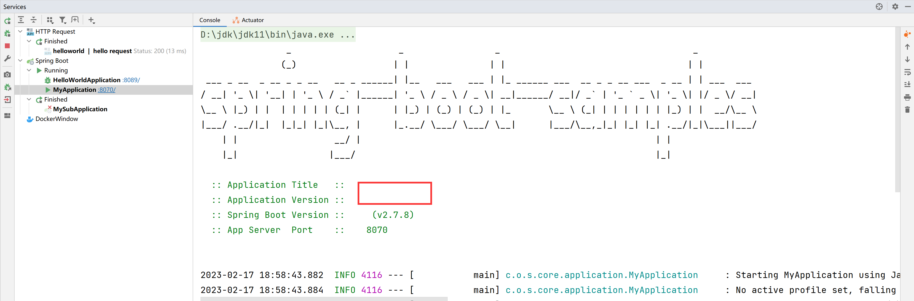
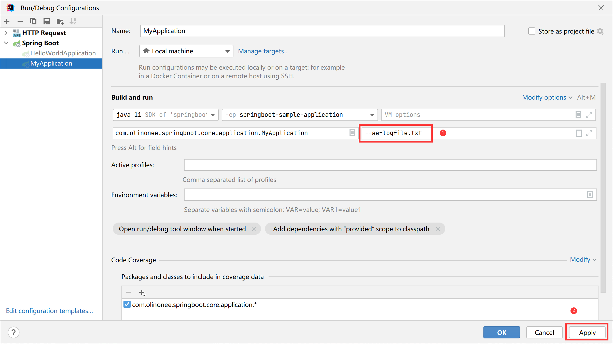

# SpringApplication

`SpringApplication` 类提供了一种方便的方法来引导从 `main()` 方法启动的 Spring 应用程序。在很多情况下，你可以委托给静态的 `SpringApplication.run` 方法，如下例所示:

```java
import org.springframework.boot.SpringApplication;
import org.springframework.boot.autoconfigure.SpringBootApplication;

@SpringBootApplication
public class MyApplication {
    public static void main(String[] args) {
        SpringApplication.run(MyApplication.class, args);
    }
}
```

程序启动可能会看到类似如下的输出信息：

```text
  .   ____          _            __ _ _
 /\\ / ___'_ __ _ _(_)_ __  __ _ \ \ \ \
( ( )\___ | '_ | '_| | '_ \/ _` | \ \ \ \
 \\/  ___)| |_)| | | | | || (_| |  ) ) ) )
  '  |____| .__|_| |_|_| |_\__, | / / / /
 =========|_|==============|___/=/_/_/_/
 :: Spring Boot ::                (v2.7.8)

2023-02-17 12:51:57.711  INFO 30352 --- [           main] c.o.s.quickstart.HelloWorldApplication   : Starting HelloWorldApplication using Java 11.0.9 on DESKTOP-2ILNKER with PID 30352 (E:\IdeaWorkspace\todo-projects\spring-boot-samples\springboot-sample-quickstart\target\classes started by 16602 in E:\IdeaWorkspace\todo-projects\spring-boot-samples)
2023-02-17 12:51:57.713  INFO 30352 --- [           main] c.o.s.quickstart.HelloWorldApplication   : No active profile set, falling back to 1 default profile: "default"
2023-02-17 12:51:58.145  INFO 30352 --- [           main] o.s.b.w.embedded.tomcat.TomcatWebServer  : Tomcat initialized with port(s): 8089 (http)
2023-02-17 12:51:58.146  INFO 30352 --- [           main] o.a.catalina.core.AprLifecycleListener   : Loaded Apache Tomcat Native library [1.2.33] using APR version [1.7.0].
2023-02-17 12:51:58.146  INFO 30352 --- [           main] o.a.catalina.core.AprLifecycleListener   : APR capabilities: IPv6 [true], sendfile [true], accept filters [false], random [true], UDS [true].
2023-02-17 12:51:58.146  INFO 30352 --- [           main] o.a.catalina.core.AprLifecycleListener   : APR/OpenSSL configuration: useAprConnector [false], useOpenSSL [true]
2023-02-17 12:51:58.148  INFO 30352 --- [           main] o.a.catalina.core.AprLifecycleListener   : OpenSSL successfully initialized [OpenSSL 1.1.1o  3 May 2022]
2023-02-17 12:51:58.153  INFO 30352 --- [           main] o.apache.catalina.core.StandardService   : Starting service [Tomcat]
2023-02-17 12:51:58.153  INFO 30352 --- [           main] org.apache.catalina.core.StandardEngine  : Starting Servlet engine: [Apache Tomcat/9.0.71]
2023-02-17 12:51:58.205  INFO 30352 --- [           main] o.a.c.c.C.[Tomcat].[localhost].[/]       : Initializing Spring embedded WebApplicationContext
2023-02-17 12:51:58.205  INFO 30352 --- [           main] w.s.c.ServletWebServerApplicationContext : Root WebApplicationContext: initialization completed in 469 ms
2023-02-17 12:51:58.396  INFO 30352 --- [           main] o.s.b.w.embedded.tomcat.TomcatWebServer  : Tomcat started on port(s): 8080 (http) with context path ''
2023-02-17 12:51:58.403  INFO 30352 --- [           main] c.o.s.quickstart.HelloWorldApplication   : Started HelloWorldApplication in 0.946 seconds (JVM running for 1.698)
```

默认情况下，将显示 `INFO` 日志消息，包括一些相关的启动细节，例如启动应用程序的用户。如果需要的日志级别不是 `INFO`，可以设置为[其他日志级别]()
。应用程序版本是使用主应用程序类包中的实现版本确定的。启动信息日志记录可以通过设置关闭 `spring.main.log-startup-info` 设为 `false`。这也将关闭应用程序活动配置文件的日志记录。

**application.yml**：

```yaml
# 服务器默认端口 8080
server:
  port: 8070

spring:
  main:
    # 是否开启启动日志（默认为 true），true：开启；false：关闭
    log-startup-info: false
```

关闭启动日志之后，日志少了 `SpringBoot` 启动相关的日志，控制台输出如下：

```text
  .   ____          _            __ _ _
 /\\ / ___'_ __ _ _(_)_ __  __ _ \ \ \ \
( ( )\___ | '_ | '_| | '_ \/ _` | \ \ \ \
 \\/  ___)| |_)| | | | | || (_| |  ) ) ) )
  '  |____| .__|_| |_|_| |_\__, | / / / /
 =========|_|==============|___/=/_/_/_/
 :: Spring Boot ::                (v2.7.8)

2023-02-17 12:59:46.547  INFO 27108 --- [           main] o.s.b.w.embedded.tomcat.TomcatWebServer  : Tomcat initialized with port(s): 8070 (http)
2023-02-17 12:59:46.548  INFO 27108 --- [           main] o.a.catalina.core.AprLifecycleListener   : Loaded Apache Tomcat Native library [1.2.33] using APR version [1.7.0].
2023-02-17 12:59:46.548  INFO 27108 --- [           main] o.a.catalina.core.AprLifecycleListener   : APR capabilities: IPv6 [true], sendfile [true], accept filters [false], random [true], UDS [true].
2023-02-17 12:59:46.549  INFO 27108 --- [           main] o.a.catalina.core.AprLifecycleListener   : APR/OpenSSL configuration: useAprConnector [false], useOpenSSL [true]
2023-02-17 12:59:46.550  INFO 27108 --- [           main] o.a.catalina.core.AprLifecycleListener   : OpenSSL successfully initialized [OpenSSL 1.1.1o  3 May 2022]
2023-02-17 12:59:46.556  INFO 27108 --- [           main] o.apache.catalina.core.StandardService   : Starting service [Tomcat]
2023-02-17 12:59:46.556  INFO 27108 --- [           main] org.apache.catalina.core.StandardEngine  : Starting Servlet engine: [Apache Tomcat/9.0.71]
2023-02-17 12:59:46.608  INFO 27108 --- [           main] o.a.c.c.C.[Tomcat].[localhost].[/]       : Initializing Spring embedded WebApplicationContext
2023-02-17 12:59:46.608  INFO 27108 --- [           main] w.s.c.ServletWebServerApplicationContext : Root WebApplicationContext: initialization completed in 501 ms
2023-02-17 12:59:46.803  INFO 27108 --- [           main] o.s.b.w.embedded.tomcat.TomcatWebServer  : Tomcat started on port(s): 8070 (http) with context path ''
```

**TIP**：

要在启动期间添加额外的日志记录，可以在 `SpringApplication` 的子类中重写 `logStartupInfo(boolean)`。

## 1.启动失败

如果应用程序无法启动，注册的 `FailureAnalyzers` 将有机会提供专用错误消息和解决问题的具体操作。例如，如果在端口 8080 上启动一个 web 应用程序，并且该端口已经在使用中，那么应该会看到类似以下消息的内容:

```text
***************************
APPLICATION FAILED TO START
***************************

Description:

Embedded servlet container failed to start. Port 8080 was already in use.

Action:

Identify and stop the process that is listening on port 8080 or configure this application to listen on another port.
```

**注意**：

`SpringBoot` 提供了许多 `FailureAnalyzer` 实现，也可以添加自己的实现。

如果没有故障分析器能够处理异常，仍然可以显示完整的条件报告，以更好地了解哪里出了问题。
为此，需要启用 `org.springframework.boot.autoconfigure.logging.ConditionEvaluationReportLoggingListener` 的调试属性或启用调试日志记录。
例如，如果您正在使用 `java -jar` 运行应用程序，则可以按如下方式启用调试属性：

```shell
java -jar myproject-0.0.1-SNAPSHOT.jar --debug
```

## 2.延迟初始化

`SpringApplication` 允许应用程序延迟初始化。如果启用了延迟初始化，则会根据需要而不是在应用程序启动期间创建 bean。因此，启用延迟初始化可以减少应用程序启动所需的时间。在 web 应用程序中，启用延迟初始化将导致许多
web 相关 bean 在收到 HTTP 请求之前无法初始化。

延迟初始化的一个缺点是它会延迟应用程序问题的发现。如果延迟初始化错误配置的 Bean，则在启动过程中不会再出现故障，只有在初始化 Bean 时，问题才会变得明显。还必须注意确保 JVM 有足够的内存来容纳应用程序的所有
Bean，而不仅仅是那些在启动期间初始化的 Bean。由于这些原因，默认情况下不启用延迟初始化，建议在启用延迟初始化之前对 JVM 的堆大小进行微调。

可以使用 `SpringApplicationBuilder` 上的 `lazyInitialization` 方法或 `SpringApplication` 上的 `setLazyInitialize`
方法以编程方式启用延迟初始化。或者，可以使用 `spring.main.lazy-initialization` 属性启用它，如下例所示：

```yaml
spring:
  main:
    # 是否延迟初始化，默认为 false 
    lazy-initialization: true
```

**TIP**：

如果希望禁用某些 Bean 的延迟初始化，同时对应用程序的其余部分使用延迟初始化，则可以使用 `@Lazy(false)` 注释将它们的延迟属性显式设置为 false。

## 3.自定义 Banner

在启动时打印的 banner 可以通过在类路径中添加 `banner.txt` 文件或将 `spring.banner.location` 属性设置为这样一个文件的位置来更改。如果文件的编码不是
UTF-8，你可以设置 `spring.banner.charset`。除了文本文件，还可以在类路径中添加 `banner.gif`、`banner.jpg` 或 `banner.png`
图像文件，或者设置 `spring.banner.image.location` 属性。图像转换为 ASCII 艺术表示和打印在任何文本的 banner。

在 `banner.txt` 文件中，可以使用环境中可用的任何密钥以及以下占位符：

**Banner 变量**

| 变量                                                                            | 描述                                                                 |
|-------------------------------------------------------------------------------|--------------------------------------------------------------------|
| ${application.version}                                                        | 应用程序的版本号，如在 `MANIFEST.MF` 中声明。例如，`实现版本：1.0` 打印为 `1.0`。             |
| ${application.formatted-version}                                              | 应用程序的版本号，如在 `MANIFEST.MF` 中声明的，并格式化为显示（用括号括起来，前缀为 `v`）。例如（`v1.0`）。 |
| ${spring-boot.version}                                                        | 正在使用的 Spring Boot 版本。例如 `2.7.8`。                                   |
| ${spring-boot.formatted-version}                                              | 正在使用的Spring Boot版本，格式为显示（用括号括起来，前缀为 `v`）。例如（`v2.7.8`）。             |
| ${Ansi.NAME} (或者 ${AnsiColor.NAME},${AnsiBackground.NAME}, ${AnsiStyle.NAME}) | `NAME` 是 ANSI 转义代码的名称。有关详细信息，请参见 `AnsiPropertySource`。             |
| ${application.title}                                                          | 这个应用程序的标题被声明在 `MANIFEST.MF` 中。例如，`实现版本-Title: MyApp` 打印为 `MyApp`   |

**TIP**：

如果你想通过编程方式生成一个 banner，可以使用 `SpringApplication.setBanner(…)`方法。使用 `org.springframework.boot.Banner`
接口并实现自己的 `printBanner()` 方法。

还可以使用 `spring.main.banner-mode` 属性来确定 banner 是否必须在 `System.out(console)` 上打印、发送到配置的日志器(`log`) 或根本不生成(`off`)。

**application.yml**：

```yaml
spring:
  main:
    # banner 模式：console（打印到控制台）、log（打印到日志文件）、off（关闭）
    banner-mode: off
```

打印的 banner 被注册为一个单例 bean，名称如下: `springBootBanner`。

**注意**：

只有在使用 SpringBoot 启动程序时，`${application.version}` 和 `${appliation.formatted-version}` 属性才可用。如果正在运行一个未打包的 jar
并使用 `java-cp <classpath> <mainclass>` 启动它，则不会解析这些值。

这就是为什么我们建议始终使用 `java org.springframework.boot.loader.JarLauncher` 启动未打包的 jar
包。这将在构建类路径和启动应用程序之前初始化 `application.*` banner变量。

配置的 banner.txt 内容如下：

```text
                _                    _                 _                                    _
               (_)                  | |               | |                                  | |
 ___ _ __  _ __ _ _ __   __ _ ______| |__   ___   ___ | |_ ______ ___  __ _ _ __ ___  _ __ | | ___  ___
/ __| '_ \| '__| | '_ \ / _` |______| '_ \ / _ \ / _ \| __|______/ __|/ _` | '_ ` _ \| '_ \| |/ _ \/ __|
\__ \ |_) | |  | | | | | (_| |      | |_) | (_) | (_) | |_       \__ \ (_| | | | | | | |_) | |  __/\__ \
|___/ .__/|_|  |_|_| |_|\__, |      |_.__/ \___/ \___/ \__|      |___/\__,_|_| |_| |_| .__/|_|\___||___/
    | |                  __/ |                                                       | |
    |_|                 |___/                                                        |_|
${AnsiColor.GREEN}
  :: Application Title   ::    ${application.title}
  :: Application Version ::    ${application.formatted-version}
  :: Spring Boot Version ::    ${spring-boot.formatted-version}
  :: App Server  Port    ::    ${server.port}
${AnsiColor.BLACK}

```

启动效果如下图所示：



**扩展**：

banner 艺术字体生成网址链接如下：

> - [ASCII Generator](http://www.network-science.de/ascii/) </br>
> - [Ascii Text / Signature Generator](http://www.kammerl.de/ascii/AsciiSignature.php) </br>
> - [Text to ASCII Art Generator (TAAG)](http://patorjk.com/software/taag/#p=display&f=Graffiti&t=Type%20Something%20) </br>
> - [Spring Boot banner在线生成工具，制作下载banner.txt，修改替换banner.txt文字实现自定义，个性化启动banner](https://www.bootschool.net/ascii) </br>

## 4.自定义 SpringApplication 程序

如果 `SpringApplication` 默认值不符合你的口味，可以创建一个本地实例来自定义它。例如，要关闭 banner，可以写：

```java
import org.springframework.boot.Banner;
import org.springframework.boot.SpringApplication;
import org.springframework.boot.autoconfigure.SpringBootApplication;

@SpringBootApplication
public class MyApplication {
    public static void main(String[] args) {
        final SpringApplication application = new SpringApplication(MyApplication.class);
        application.setBannerMode(Banner.Mode.OFF);
        application.run(args);
    }
}
```

**注意**：

传递给 `SpringApplication` 的构造函数参数是 Spring Bean 的配置源。在大多数情况下，这些是对 `@Configuration` 类的引用，但也可以是对 `@Component` 类的直接引用。

也可以使用 `application.properties` 文件配置 `SpringApplication`。

有关配置选项的完整列表，请参阅 [SpringApplication Javadoc](https://docs.spring.io/spring-boot/docs/2.7.8/api/org/springframework/boot/SpringApplication.html)
。

## 5.优雅的构建器 API

如果需要构建 `ApplicationContext` 层次结构（具有父/子关系的多个上下文），或者如果喜欢使用 “fluent”（本义是流畅、流利，个人觉得优雅更好听一点） 的构建器
API，则可以使用 `SpringApplicationBuilder`。

`SpringApplicationBuilder` 允许将多个方法调用链接在一起，并包括父方法和子方法，以创建层次结构，如以下示例所示：

```java
import org.springframework.boot.builder.SpringApplicationBuilder;

new SpringApplicationBuilder()
        .sources(Parent.class)
        .child(Application.class)
        .bannerMode(Banner.Mode.OFF)
        .run(args);
```

**注意**：

创建 `ApplicationContext` 层次结构时有一些限制。例如，Web 组件**必须**包含在子上下文中，并且父上下文和子上下文使用相同的 `Environment`
。详见 [SpringApplicationBuilder Javadoc](https://docs.spring.io/spring-boot/docs/2.7.8/api/org/springframework/boot/builder/SpringApplicationBuilder.html)
。

## 6.应用程序可用性

在平台上部署时，应用程序可以使用 [Kubernetes Probes](https://kubernetes.io/docs/tasks/configure-pod-container/configure-liveness-readiness-startup-probes/)
等基础设施向平台提供关于其可用性的信息。SpringBoot 包括对常用的 “活跃” 和 “就绪” 可用性状态的开箱即用支持。如果正在使用 SpringBoot 的 “actuator” 支持，那么这些状态将作为运行状况端点组公开。

此外，您还可以通过将 `ApplicationAvailability` 接口注入到自己的 bean 中来获得可用性状态。

### 活跃状态

应用程序的 “活跃” 状态告诉它的内部状态是否允许它正常工作，或者如果它当前出现故障，是否可以自行恢复。中断的 “活跃” 状态意味着应用程序处于无法恢复的状态，基础结构应重新启动应用程序。

**注意**：

通常，“活跃” 状态不应基于外部检查，如健康检查。如果发生了这种情况，出现故障的外部系统（数据库、Web API、外部缓存）将触发整个平台的大规模重启和级联故障。

Spring Boot 应用程序的内部状态主要由 Spring `ApplicationContext` 表示。如果应用程序上下文已成功启动，则 Spring Boot
假定应用程序处于有效状态。一旦上下文被刷新，应用程序就被认为是活动的，请参阅 Spring Boot 应用程序生命周期和相关的应用程序事件。

### 就绪状态

应用程序的 “就绪” 状态告诉应用程序是否已准备好处理流量。失败的 “就绪” 状态告诉平台现在不应该将流量路由到应用程序。这通常发生在启动过程中，在处理 `CommandLineRunner` 和 `ApplicationRunner`
组件时，或者在应用程序决定太忙而无法处理额外流量时的任何时候。

一旦调用了应用程序和命令行运行程序，就认为应用程序已准备就绪，请参阅 Spring Boot 应用程序生命周期和相关的应用程序事件。

**TIP**：

启动期间预期运行的任务应由 `CommandLineRunner` 和 `ApplicationRunner` 组件执行，而不是使用 Spring 组件生命周期回调（如 `@PostConstruct`）。

### 管理程序的可用性状态

应用程序组件可以随时通过注入 `ApplicationAvailability` 接口并调用其上的方法来检索当前可用性状态。更常见的情况是，应用程序希望侦听状态更新或更新应用程序的状态。

例如，我们可以将应用程序的 “就绪” 状态导出到一个文件，以便 Kubernetes "exec Probe" 可以查看这个文件:

```java
import org.springframework.boot.availability.AvailabilityChangeEvent;
import org.springframework.boot.availability.ReadinessState;
import org.springframework.context.event.EventListener;
import org.springframework.stereotype.Component;

@Component
public class MyReadinessStateExporter {

    @EventListener
    public void onStateChange(AvailabilityChangeEvent<ReadinessState> event) {
        switch (event.getState()) {
            case ACCEPTING_TRAFFIC:
                // create file /tmp/healthy
                break;
            case REFUSING_TRAFFIC:
                // remove file /tmp/healthy
                break;
        }
    }
}
```

当应用程序崩溃且无法恢复时，我们也可以更新应用程序的状态:

```java
import org.springframework.boot.availability.AvailabilityChangeEvent;
import org.springframework.boot.availability.LivenessState;
import org.springframework.context.ApplicationEventPublisher;
import org.springframework.stereotype.Component;

@Component
public class MyLocalCacheVerifier {

    private final ApplicationEventPublisher eventPublisher;

    public MyLocalCacheVerifier(ApplicationEventPublisher eventPublisher) {
        this.eventPublisher = eventPublisher;
    }

    public void checkLocalCache() {
        try {
            // ...
        } catch (CacheCompletelyBrokenException ex) {
            AvailabilityChangeEvent.publish(this.eventPublisher, ex,
                    LivenessState.BROKEN);
        }
    }
}
```

Spring Boot 为 Kubernetes 提供了带有 Actuator Health Endpoint 的 “活跃度” 和 “就绪性” 的 HTTP 探测器。可以在专用部分中获得更多关于在 Kubernetes 上部署 Spring
Boot 应用程序的指导。

## 7.应用程序事件和监听器

除了通常的 Spring 框架事件，例如 `ContextRefreshedEvent`, `SpringApplication` 还会发送一些附加的应用程序事件。

**注意**：

有些事件实际上是在创建 `ApplicationContext` 之前触发的，因此不能将侦听器注册为 `@Bean`。可以使用 `SpringApplication.addListeners(…)`
方法或 `SpringApplicationBuilder.listeners(...)` 方法。

如果希望这些侦听器自动注册，无论应用程序的创建方式如何，都可以将 `META-INF/spring.factories`
文件添加到项目中，并使用 `org.springframework.context.ApplicationListener` 键，如下例所示：

```properties
org.springframework.context.ApplicationListener=com.example.project.MyListener
```

当应用程序运行时，应用程序事件按以下顺序发送：

1. `ApplicationStartingEvent`：程序运行开始时并且是在任何处理之前发送该事件，当然监听器和初始化器注册除外；
2. `ApplicationEnvironmentPreparedEvent`：在已知的上下文中使用 `Environment` 同时在上下文创建之前发送该事件；
3. `ApplicationContextInitializedEvent`：在已准备好的 `ApplicationContext` 并且调用了 `ApplicationContextInitializers`
   之后发送该事件，但是需要在加载任何 bean 定义之前发送；
4. `ApplicationPreparedEvent`：在刷新开始之前发送该事件，但是在加载 bean 定义之后发送；
5. `ApplicationStartedEvent`：在上下文刷新之后发送该事件，但是在调用任何应用程序和命令行运行程序之前发送；
6. `AvailabilityChangeEvent`：在 `LivenessState.CORRECT` 之后立即发送该事件，此时标识应用程序是活动的；
7. `ApplicationReadyEvent`：在调用任何应用程序和命令行运行程序之后发送该事件；
8. `AvailabilityChangeEvent`：在 `ReadinessState.ACCEPTING_TRAFFIC` 之后立即发送该事件，此时标识应用程序已准备好服务请求；
9. `ApplicationFailedEvent`：在程序启动过程中出现异常时发送该事件。

上面的列表只包括与 `SpringApplication` 相关的 `SpringApplicationEvent`。除此之外，以下事件也会在 `ApplicationPreparedEvent`
之后和 `ApplicationStartedEvent` 之前发布：

- `WebServerInitializedEvent` 在 `WebServer` 就绪后发送。`ServletWebServerInitializedEvent`
  和 `ReactiveWebServerInitializedEvent` 分别是 servlet 和 reactive 变量。
- 刷新 `ApplicationContext` 时，将发送 `ContextRefreshedEvent`。

**TIP**：

通常不需要使用应用程序事件，但知道它们的存在会很方便。在内部，Spring Boot 使用事件来处理各种任务。

**注意**：

默认情况下，事件监听器不应运行可能很长的任务，因为它们在同一线程中执行。可以考虑改用应用程序和命令行运行程序来处理。

应用程序事件是通过使用 Spring 框架的事件发布机制发送的。该机制的一部分确保发布到子上下文中的监听器事件也发布到任何祖先上下文中的监听器。因此，如果你的应用程序使用 `SpringApplication`
实例的层次结构，则监听器可能会接收同一类型的应用程序事件的多个实例。

为了允许监听器区分其上下文的事件和后代上下文的事件，它应该请求注入其应用程序上下文，然后将注入的上下文与事件的上下文进行比较。上下文可以通过实现 `ApplicationContextAware` 来注入，如果监听器是
bean，则可以使用 `@Autowired` 来注入。

## 8.Web 环境

`SpringApplication` 试图代表你创建正确类型的 `ApplicationContext`。用于确定 `WebApplicationType` 的算法如下：

- 存在 Spring MVC，使用 `AnnotationConfigServletWebServerApplicationContext`
- 如果 Spring MVC 不存在，而 Spring WebFlux 存在，则使用 `AnnotationConfigReactiveWebServerApplicationContext`
- 否则，将使用 `AnnotationConfigApplicationContext`

这意味着如果在同一应用程序中使用 `Spring MVC` 和新的来自 `Spring WebFlux` 的 `WebClient`，默认情况下将使用 `Spring MVC`
。可以通过调用 `setWebApplicationType(WebApplicationType)` 轻松地覆盖它。

也可以通过调用 `setApplicationContextClass(…)` 来完全控制 `ApplicationContext` 类型。

**TIP**：

在 JUnit 测试中使用 `SpringApplication` 时，通常需要调用 `setWebApplicationType(WebApplicationType.NONE)`。

## 9.访问应用程序参数

如果需要访问传递给 `SpringApplication.run(…)` 的应用程序参数，可以注入 `org.springframework.boot.ApplicationArguments`
bean。`ApplicationArguments` 接口提供对原始 `String[]` 参数以及解析的 `option` 和 `non-option` 参数的访问，如下例所示：

### 官网给出的示例

```java
import java.util.List;

import org.springframework.boot.ApplicationArguments;
import org.springframework.stereotype.Component;

@Component
public class MyBean {
    public MyBean(ApplicationArguments args) {
        boolean debug = args.containsOption("debug");
        List<String> files = args.getNonOptionArgs();
        if (debug) {
            System.out.println(files);
        }
        // if run with "--debug logfile.txt" prints ["logfile.txt"]
    }
}
```

### 自行改造的示例

MyBean.java

```java
import org.slf4j.Logger;
import org.slf4j.LoggerFactory;
import org.springframework.beans.factory.annotation.Autowired;
import org.springframework.boot.ApplicationArguments;
import org.springframework.stereotype.Component;

@Component
public class MyBean {

    private final static Logger logger = LoggerFactory.getLogger(MyBean.class);

    @Autowired
    private ApplicationArguments arguments;

    public void printArgs() {
        final int nonOptionArgsNum = arguments.getNonOptionArgs().size();
        final int optionNamesNum = arguments.getOptionNames().size();
        final int sourceArgsNum = arguments.getSourceArgs().length;
        logger.info("非选项参数数量为 {} 个", nonOptionArgsNum);
        logger.info("选项参数数量为 {} 个", optionNamesNum);
        logger.info("原参数数量为 {} 个", sourceArgsNum);

        if (nonOptionArgsNum > 0) {
            arguments.getNonOptionArgs().forEach(nonOptionArgs -> {
                logger.info("非可选项为 {}", nonOptionArgs);
            });
        }
        if (optionNamesNum > 0) {
            arguments.getOptionNames().forEach(optionName -> {
                logger.info("可选项名称为 {}，选项值为 {}", optionName, arguments.getOptionValues(optionName));
            });
            final boolean isExistAA = arguments.containsOption("aa");
            logger.info("是否包含 “aa” 可选项？ {}", isExistAA);
        }
        if (sourceArgsNum > 0) {
            for (String sourceArg : arguments.getSourceArgs()) {
                logger.info("原参数为 {}", sourceArg);
            }
        }
    }
}
```

MyApplication.java

```java
import org.springframework.boot.Banner;
import org.springframework.boot.SpringApplication;
import org.springframework.boot.autoconfigure.SpringBootApplication;
import org.springframework.context.ConfigurableApplicationContext;

@SpringBootApplication
public class MyApplication {
    public static void main(String[] args) {
        final SpringApplication application = new SpringApplication(MyApplication.class);
        application.setBannerMode(Banner.Mode.OFF);
        final ConfigurableApplicationContext context = application.run(args);
        final MyBean myBean = context.getBean(MyBean.class);
        myBean.printArgs();
    }
}
```

idea 启动配置



控制台输出内容如下：

```text
2023-02-18 15:56:52.335  INFO 4172 --- [           main] c.o.s.core.application.MyApplication     : Starting MyApplication using Java 11.0.9 on DESKTOP-2ILNKER with PID 4172 (E:\IdeaWorkspace\todo-projects\spring-boot-samples\springboot-sample-core\springboot-sample-application\target\classes started by 16602 in E:\IdeaWorkspace\todo-projects\spring-boot-samples)
2023-02-18 15:56:52.337  INFO 4172 --- [           main] c.o.s.core.application.MyApplication     : No active profile set, falling back to 1 default profile: "default"
2023-02-18 15:56:52.743  INFO 4172 --- [           main] o.s.b.w.embedded.tomcat.TomcatWebServer  : Tomcat initialized with port(s): 8070 (http)
2023-02-18 15:56:52.743  INFO 4172 --- [           main] o.a.catalina.core.AprLifecycleListener   : Loaded Apache Tomcat Native library [1.2.33] using APR version [1.7.0].
2023-02-18 15:56:52.743  INFO 4172 --- [           main] o.a.catalina.core.AprLifecycleListener   : APR capabilities: IPv6 [true], sendfile [true], accept filters [false], random [true], UDS [true].
2023-02-18 15:56:52.743  INFO 4172 --- [           main] o.a.catalina.core.AprLifecycleListener   : APR/OpenSSL configuration: useAprConnector [false], useOpenSSL [true]
2023-02-18 15:56:52.745  INFO 4172 --- [           main] o.a.catalina.core.AprLifecycleListener   : OpenSSL successfully initialized [OpenSSL 1.1.1o  3 May 2022]
2023-02-18 15:56:52.750  INFO 4172 --- [           main] o.apache.catalina.core.StandardService   : Starting service [Tomcat]
2023-02-18 15:56:52.750  INFO 4172 --- [           main] org.apache.catalina.core.StandardEngine  : Starting Servlet engine: [Apache Tomcat/9.0.71]
2023-02-18 15:56:52.800  INFO 4172 --- [           main] o.a.c.c.C.[Tomcat].[localhost].[/]       : Initializing Spring embedded WebApplicationContext
2023-02-18 15:56:52.801  INFO 4172 --- [           main] w.s.c.ServletWebServerApplicationContext : Root WebApplicationContext: initialization completed in 438 ms
2023-02-18 15:56:52.871  INFO 4172 --- [           main] o.s.b.w.embedded.tomcat.TomcatWebServer  : Tomcat started on port(s): 8070 (http) with context path ''
2023-02-18 15:56:52.891  INFO 4172 --- [           main] c.o.s.core.application.MyApplication     : Started MyApplication in 0.836 seconds (JVM running for 1.465)
2023-02-18 15:56:52.895  INFO 4172 --- [           main] c.o.springboot.core.application.MyBean   : 非选项参数数量为 0 个
2023-02-18 15:56:52.895  INFO 4172 --- [           main] c.o.springboot.core.application.MyBean   : 选项参数数量为 1 个
2023-02-18 15:56:52.895  INFO 4172 --- [           main] c.o.springboot.core.application.MyBean   : 原参数数量为 1 个
2023-02-18 15:56:52.895  INFO 4172 --- [           main] c.o.springboot.core.application.MyBean   : 可选项名称为 aa，选项值为 [logfile.txt]
2023-02-18 15:56:52.896  INFO 4172 --- [           main] c.o.springboot.core.application.MyBean   : 是否包含 “aa” 可选项？ true
2023-02-18 15:56:52.896  INFO 4172 --- [           main] c.o.springboot.core.application.MyBean   : 原参数为 --aa=logfile.txt
```

**TIP**：

Spring Boot 还向 Spring `Environment` 注册了一个 `CommandLinePropertySource`。这还允许通过使用 `@Value` 注解注入单个应用程序参数。

## 10.使用 ApplicationRunner 或者 CommandLineRunner

如果需要在 `SpringApplication` 启动后运行一些特定的代码，可以实现 `ApplicationRunner` 或 `CommandLineRunner` 接口。这两个接口以相同的方式工作，并提供一个单独的 `run`
方法，该方法在 `SpringApplication.run(…)` 完成之前被调用。

**注意**：

此约定非常适合在应用程序启动后但在开始接受流量之前运行的任务。

`CommandLineRunner` 接口提供对应用程序参数的字符串数组访问，而 `ApplicationRunner` 使用前面讨论的 `ApplicationArguments` 接口。下面的例子显示了一个带有 `run`
方法的 `CommandLineRunner`:

```java
import org.springframework.boot.CommandLineRunner;
import org.springframework.stereotype.Component;

@Component
public class MyCommandLineRunner implements CommandLineRunner {
    @Override
    public void run(String... args) {
        // Do something...
    }
}
```

如果定义了几个必须按特定顺序调用的 `CommandLineRunner` 或 `ApplicationRunner` bean，则可以另外实现 `org.springframework.core.Ordered`
接口或使用 `org.springframework.core.annotation.Order` 注解。

## 11.应用程序退出

每个 `SpringApplication` 都向 JVM 注册一个关闭钩子，以确保 `ApplicationContext` 在退出时正常关闭。所有标准的 Spring 生命周期回调(如 `DisposableBean`
接口或 `@PreDestroy` 注解)都可以使用。

此外，如果 bean 希望在调用 `SpringApplication.exit()` 时返回特定的退出码，它们可以实现 `org.springframework.boot.ExitCodeGenerator`
接口。然后，这个退出码可以传递给 `System.exit()` 以状态码的形式返回，如下例所示:

```java
import org.springframework.boot.ExitCodeGenerator;
import org.springframework.boot.SpringApplication;
import org.springframework.boot.autoconfigure.SpringBootApplication;
import org.springframework.context.annotation.Bean;

@SpringBootApplication
public class MyApplication {

    @Bean
    public ExitCodeGenerator exitCodeGenerator() {
        return () -> 42;
    }

    public static void main(String[] args) {
        System.exit(SpringApplication.exit(SpringApplication.run(MyApplication.class,
                args)));
    }
}
```

控制台输出内容如下：

```text
Connected to the target VM, address: '127.0.0.1:61941', transport: 'socket'
....
Disconnected from the target VM, address: '127.0.0.1:61941', transport: 'socket'

Process finished with exit code 42
```

此外，`ExitCodeGenerator` 接口可以通过异常实现。当遇到这样的异常时，Spring Boot 返回由已实现的 `getExitCode()` 方法提供的退出码。

如果存在多个 `ExitCodeGenerator`，则使用生成的第一个非零退出代码。要控制调用生成器的顺序，请另外实现 `org.springframework.core.Ordered`
接口或使用 `org.springframework.core.annotation.Order` 注解。

## 12.管理功能

可以通过指定 `spring.application.admin.enabled` 属性。这将在 `MBeanServer` 平台上公开 `SpringApplicationAdminMXBean`。可以使用此功能远程管理 Spring
Boot 应用程序。这个特性对于任何服务包装器实现都很有用。

`TIP`：

如果想知道应用程序正在哪个 HTTP 端口上运行，请使用 `local.server.port` 键获取属性。如下有三种方式，准确来说是两种，前两种是同一种方式。

- 通过注解 `@LocalServerPort` 获取
- 通过注解 `@Value` 获取
- 通过 `Environment` 获取

MyBean.java

```java
import org.slf4j.Logger;
import org.slf4j.LoggerFactory;
import org.springframework.beans.factory.annotation.Autowired;
import org.springframework.beans.factory.annotation.Value;
import org.springframework.boot.web.server.LocalServerPort;
import org.springframework.core.env.Environment;
import org.springframework.stereotype.Component;

@Component
public class MyBean {

    private final static Logger logger = LoggerFactory.getLogger(MyBean.class);

    /**
     * 端口号：方式一（注解方式，已被遗弃，底层其实使用方式二这种方式）
     */
    @LocalServerPort
    private int port1;

    /**
     * 端口号：方式二（使用@Value方式）
     */
    @Value("${local.server.port}")
    private int port2;

    /**
     * 端口号：方式三（使用Environment方式）
     */
    @Autowired
    private Environment environment;

    /**
     * 获取端口
     */
    public void getPort() {
        logger.info("方式一（注解方式，已被遗弃），port -> {}", port1);
        logger.info("方式二（使用@Value方式），port -> {}", port2);
        logger.info("方式三（使用Environment方式），port -> {}", environment.getProperty("local.server.port"));
    }
}
```

MyApplication.java

```java
import org.springframework.boot.SpringApplication;
import org.springframework.boot.autoconfigure.SpringBootApplication;
import org.springframework.context.ConfigurableApplicationContext;

@SpringBootApplication
public class MyApplication {

    public static void main(String[] args) {
        final SpringApplication application = new SpringApplication(MyApplication.class);
        final ConfigurableApplicationContext context = application.run(args);
        final MyBean myBean = context.getBean(MyBean.class);
        myBean.getPort();
    }
}
```

## 13.应用程序启动跟踪

在应用程序启动期间，`SpringApplication` 和 `ApplicationContext` 执行许多与应用程序生命周期、bean 生命周期甚至处理应用程序事件相关的任务。使用 `ApplicationStartup`
，Spring Framework 允许使用 `StartupStep` 对象跟踪应用程序启动顺序。收集这些数据可以用于分析目的，或者只是为了更好地了解应用程序启动过程。

在设置 `SpringApplication` 实例时，可以选择 `ApplicationStartup` 实现。例如，要使用 `BufferingApplicationStartup`，可以编写：

```java
import org.springframework.boot.SpringApplication;
import org.springframework.boot.autoconfigure.SpringBootApplication;
import org.springframework.boot.context.metrics.buffering.BufferingApplicationStartup;

@SpringBootApplication
public class MyApplication {
    public static void main(String[] args) {
        SpringApplication application = new SpringApplication(MyApplication.class);
        application.setApplicationStartup(new BufferingApplicationStartup(2048));
        application.run(args);
    }
}
```
第一个可用的实现 `FlightRecorderApplicationStartup` 由 Spring 框架提供。它将特定于 Spring 的启动事件添加到 Java Flight Recorder 会话中，用于分析应用程序并将其 Spring 上下文生命周期与 JVM 事件（如分配、GC、类加载…）关联起来。配置后，您可以在启用飞行记录器的情况下运行应用程序来记录数据：

```shell
$ java -XX:StartFlightRecording:filename=recording.jfr,duration=10s -jar demo.jar
```

JFR 详细使用指南，参考 [在 OpenJDK 中使用 JDK Flight Recorder](https://access.redhat.com/documentation/zh-cn/openjdk/11/html/using_jdk_flight_recorder_with_openjdk/index)

Spring Boot 附带了 `BufferingApplicationStartup` 变体；该实现用于缓冲启动步骤并将其排入外部指标系统。应用程序可以在任何组件中请求 `BufferingApplicationStartup` 类型的 Bean。Spring Boot 还可以配置为公开一个启动端点，该端点将此信息作为 JSON 文档提供。
