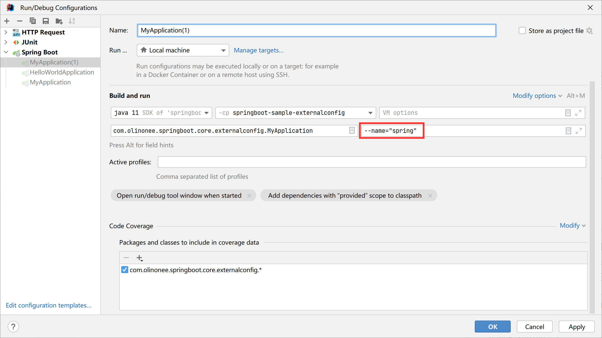

# 外部化配置（Externalized Configuration）

Spring Boot 允许将配置外部化，方便在不同的环境中使用相同的应用程序代码。你可以使用各种外部配置源，包括 Java 配置文件、YAML 文件、环境变量和命令行参数。
属性值可以使用 `@Value` 注解直接注入到 bean 中，通过 Spring 的 `Environment` 抽象访问，或者通过 `@ConfigurationProperties` 绑定到结构化对象。

Spring Boot 使用了一个非常特殊的 `PropertySource` 顺序，旨在允许合理地重写值。以后的属性源可以替代以前的属性源中定义的值。信息来源按以下顺序考虑：

1. 默认属性(通过设置 `SpringApplication.setDefaultProperties` 指定)；
2. `@PropertySource` 注解注释在你的 `@Configuration` 配置类上。请注意，在刷新应用程序上下文之前，此类属性源不会添加到环境中。现在配置某些属性为时已晚，例如 `logging.*`
   和 `spring.main.*`，它们是在刷新开始之前读取的；
3. 配置数据(例如 `application.properties` 文件)；
4. `RandomValuePropertySource` 只在 `random.*` 中有属性；
5. 操作系统环境变量；
6. Java 系统属性(`System.getProperties()`)；
7. 来自 `java:comp/env` 的 JNDI 属性；
8. `ServletContext` 初始化参数；
9. `ServletConfig` 初始化参数；
10. `SPRING_APPLICATION_JSON` 的属性(内嵌在环境变量或系统属性中的内联 JSON)；
11. 命令行参数；
12. 在你的测试上的 `properties` 属性，在 `@SpringBootTest` 和测试注解中可用，用于测试应用程序的特定部分；
13. 用于你的测试类 `@TestPropertySource` 注解；
14. 当 DevTools 处于活动状态时，`$HOME/.config/spring-boot` 目录中的 DevTools 全局设置属性。

配置数据文件按以下顺序考虑：

1. 打包在 JAR 中的应用程序属性(application.properties 和 YAML 变体)；
2. 打包在 JAR 中的特定于配置文件的应用程序属性(application-{profile}.properties 和 YAML 变体)；
3. 打包在 JAR 之外的应用程序属性(application.properties 和 YAML 变体)；
4. 打包在 JAR 之外的特定于配置文件的应用程序属性(application-{profile}.properties 和 YAML 变体)；

**注意**：

对于整个应用程序，建议坚持使用一种格式。如果在同一位置具有同时具有 `.properties` 和 `.yml` 格式的配置文件，则 `.properties` 优先。

为了提供一个具体的示例，假设开发了一个使用 `name` 属性的 `@Component`，如下例所示：

```java
import org.springframework.beans.factory.annotation.Value;
import org.springframework.stereotype.Component;

@Component
public class MyBean {

    @Value("${name}")
    private String name;

    public String getName() {
        return name;
    }
}
```

在应用程序类路径上（例如，在 jar 中），可以有一个 `application.properties` 文件，该文件为 name 提供合理的默认属性值。在新环境中运行时，可以在 jar
外部提供 `application.properties` 文件来覆盖 `name` 值。对于一次性测试，可以使用特定的命令行开关启动（例如，`java -jar app.jar --name="Spring"`）。

**application.yml**:

```yaml
name: springboot
```

运行启动配置如下图所示：



控制台输出内容如下：

```text
...
2023-02-20 11:53:37.123  INFO 14740 --- [           main] o.s.b.w.embedded.tomcat.TomcatWebServer  : Tomcat started on port(s): 8080 (http) with context path ''
2023-02-20 11:53:37.130  INFO 14740 --- [           main] c.o.s.core.externalconfig.MyApplication  : Started MyApplication in 0.959 seconds (JVM running for 1.611)
name：spring
```

**TIP**：

`env` 和 `configprops` 端点在确定属性为何具有特定值时非常有用。可以使用这两个端点诊断意外的属性值。

## 1.访问命令行属性

默认情况下，`SpringApplication` 将任何命令行选项参数（即以 `--` 开头的参数，例如 `--server.port=9000`）转换为 `property`，并将其添加到 Spring `Environment`
中。如前所述，命令行属性始终优先于基于文件的属性源。

如果不希望将命令行属性添加到 `Environment` 中，可以禁用它们。通过使用 `SpringApplication.setAddCommandLineProperties(false)`。如下例所示：

```java
import org.springframework.boot.SpringApplication;
import org.springframework.boot.autoconfigure.SpringBootApplication;


@SpringBootApplication
public class MyApplication {


    public static void main(String[] args) {
        final SpringApplication springApplication = new SpringApplication(MyApplication.class);
        // 禁用命令行参数
        springApplication.setAddCommandLineProperties(false);
        springApplication.run(args);
    }
}
```

## 2.JSON 应用程序属性

环境变量和系统属性通常有一些限制，这意味着某些属性名称不能使用。为了帮助实现这一点，Spring Boot 允许将属性块编码到单个 JSON 结构中。

当应用程序启动时，任何 `spring.application.json` 或 `SPRING_APPLICATION_JSON` 属性都将被解析并添加到 Environment 中。

例如，`SPRING_APPLICATION_JSON` 属性可以在 UN*X shell 的命令行中作为环境变量提供：

```shell
$ SPRING_APPLICATION_JSON='{"my":{"name":"test"}}' java -jar myapp.jar
```

在前面的例子中，在 Spring `Environment` 中得到 `my.name=test`。

同样的 JSON 也可以作为系统属性提供：

```shell
$ java -Dspring.application.json='{"my":{"name":"test"}}' -jar myapp.jar
```

或者你可以使用命令行参数来提供 JSON：

```shell
$ java -jar myapp.jar --spring.application.json='{"my":{"name":"test"}}'
```

如果要部署到经典的应用程序服务器，还可以使用名为 `java:comp/env/spring.application.json` 的 JNDI 变量。

**注意**：

尽管来自 JSON 的 null 值将被添加到结果属性源，但 `PropertySourcesPropertyResolver` 将 null 属性视为缺少的值。这意味着 JSON 不能用 null 值覆盖来自低级属性源的属性。

## 3.外部应用程序属性

当应用程序启动时，Spring Boot 将自动从以下位置查找并加载 `application.properties` 和 `application.yaml` 文件：

1. 类路径

   a. 类路径根

   b. 类路径 `/config` 包
2. 当前目录

   a. 当前目录

   b. 当前目录下的 `config/` 子目录

   c. `config/` 子目录的直接子目录

列表按优先级排序（来自较低项的值覆盖较早的项）。加载文件中的文档作为 `PropertySources` 添加到 Spring `Environment` 中。

如果你不喜欢将 `application` 作为配置文件名，可以通过指定 `spring.config.name` 环境属性来切换到其他文件名。例如，要查找 `myproject.properties` 和 `myproject.yaml`
文件，可以按如下方式运行应用程序：

```shell
$ java -jar myproject.jar --spring.config.name=myproject
```

还可以使用 `spring.config.location` 环境属性来引用显式位置。此属性接受一个或多个要检查的位置的逗号分隔列表。

以下示例显示了如何指定两个不同的文件：

```shell
$ java -jar myproject.jar --spring.config.location=\
  optional:classpath:/default.properties,\
  optional:classpath:/override.properties
```

**TIP**：

使用 `optional` 前缀：如果位置是可选的，并且不介意它们是否存在。

**警告**：

很早就使用 `spring.config.name`、`spring.config.location` 和 `spring.config.additional-location` 来确定必须加载哪些文件。它们必须定义为环境属性（通常是 OS
环境变量、系统属性或命令行参数）。

如果 `spring.config.location` 包含目录（而不是文件），它们应该以 `/` 结尾。在运行时，它们将在加载之前附加从 `spring.config.name`
生成的名称。直接导入 `spring.config.location` 中指定的文件。

**注意**：

目录和文件位置值也被展开，以检查特定于概要文件的文件。例如，如果你有一个 `classpath:myconfig.properties` 的 `spring.config.location`
，还将找到适当的 `classpath:myconfig-<profile>.properties` 加载文件。

在大多数情况下，你添加的每个 `spring.config.location` 项都将引用单个文件或目录。位置按照定义的顺序进行处理，后一个位置可以覆盖前一个位置的值。

如果有一个复杂的位置要设置，并且使用特定于配置的配置文件，可能需要提供进一步的提示，以便 Spring Boot
知道它们应该如何分组。位置组是一组位置，这些位置都被视为处于同一级别。例如，可能希望对所有类路径位置进行分组，然后对所有外部位置进行分组。位置组中的项目应以 ";" 分隔。

使用 `spring.config.location` 配置的位置将替换默认位置。例如，如果 `spring.config.location`
配置值为 `optional:classpath:/custom-config/,optional:file:./custom-config/`，则考虑的完整位置集为：

1. `optional:classpath:custom-config/`
2. `optional:file:./custom-config/`

如果希望添加其他位置而不是替换它们，可以使用 `spring.config.additional-location`
。从其他位置加载的属性可以覆盖默认位置中的属性。例如，如果 `spring.config.additional-location`
配置了 `optional:classpath:/custom-config/,optional:file:./custom-config/`，考虑的完整位置集是：

1. `optional:classpath:/;optional:classpath:/config/`
2. `optional:file:./;optional:file:./config/;optional:file:./config/*/`
3. `optional:classpath:custom-config/`
4. `optional:file:./custom-config/`

这种搜索顺序允许你在一个配置文件中指定默认值，然后选择性地覆盖另一个配置中的这些值。可以在其中一个默认位置的 `application.properties`（或使用 `spring.config.name`
选择的任何其他基本名称）中为应用程序提供默认值。然后，可以在运行时使用位于其中一个自定义位置的不同文件覆盖这些默认值。

**注意**：

如果你使用环境变量而不是系统属性，则大多数操作系统不允许使用句点分隔的键名，但可以使用下划线(例如，`SPRING_CONFIG_NAME` 而不是 `spring.config.name`)。

**注意**：

如果你的应用程序在 Servlet 容器或应用程序服务器中运行，则可以使用 JNDI 属性(在 `java:comp/env` 中)或 Servlet 上下文初始化参数来代替环境变量或系统属性。

### 可选位置

默认情况下，当指定的配置数据位置不存在时，Spring Boot 将抛出 `ConfigDataLocationNotFoundException` 异常并且应用程序将无法启动。

如果想指定一个位置，但不介意它是否总是存在，可以使用 `optional:` 前缀。可以在 `spring.config.location` 和 `spring.config.additional-location`
属性，以及 `spring.config.import` 声明。

例如，`spring.config.import` 值为 `optional:file:/myconfig.properties` 允许应用程序启动，即使 `myconfig.properties` 文件丢失也是如此。如下例所示：

**application.yml**:

```yaml
spring:
  config:
    import: optional:/myconfig.properties
```

如果要忽略所有 `ConfigDataLocationNotFoundExceptions` 并始终继续启动应用程序，可以使用 `spring.config.on-not-found`
属性。使用 `SpringApplication.setDefaultProperties(…)` 或使用系统/环境变量设置要忽略的值。

### 通配符位置

如果配置文件位置包含最后一个路径段的 `*` 字符，则将其视为通配符位置。加载配置时会展开通配符，以便也会检查直接子目录。当存在多个配置属性源时，通配符位置在Kubernetes等环境中特别有用。

例如，如果有一些 Redis 配置和一些 MySQL 配置，可能需要保持这两种配置的分离，同时要求 `application.properties` 文件。这可能会导致两个单独的 `application.properties`
文件。安装在不同的位置，如 `/config/redis/application.properties` 和 `/config/mysql/application.properties`。在这种情况下，通配符位置为 `config/*/`
，将导致两个文件都被处理。

默认情况下，Spring Boot 在默认搜索位置包含 `config/*/`。这意味着将搜索 jar 之外的 `/config` 目录的所有子目录。

可以将通配符位置与 `spring.config.location` 和 `spring.config.additional-location` 属性一起使用。

**注意**：

通配符位置只能包含一个 `*`，对于目录搜索位置，必须以 `*/` 结尾，对于文件搜索位置，则必须以 `*/<filename>` 结尾。带有通配符的位置根据文件名的绝对路径按字母顺序排序。

**TIP**：

通配符位置仅适用于外部目录。不能在 `classpath:` 位置中使用通配符。

### 配置特定文件

除了应用程序属性文件之外，Spring Boot 还将尝试使用命名约定 `application-{profile}` 加载特定配置文件。例如，如果应用程序激活名为 `prod` 的配置文件并使用 YAML
文件，那么将同时考虑 `application.yml` 和 `application-prod.yml`。

特定配置文件的属性从与标准 `application.properties` 相同的位置加载，特定配置文件总是覆盖非特定的文件。如果指定了多个配置文件，则采用最后获胜策略。例如，如果配置文件 `prod,live`
由 `spring.profiles.active` 属性指定
，`application-prod.properties` 中的值可以被 `application-live.properties` 中的值覆盖。

**注意**：

最后获胜策略应用于位置组级别。`classpath:/cfg/,classpath:/ext/` 的 `spring.config.location` 不会有与 `classpath:/cfg/;classpath:/ext/`
相同的重写规则。

例如，继续上面的 `prod,live` 示例，我们可能有以下文件：

```text
/cfg
    application-live.properties
/ext
    application-live.properties
    application-prod.properties
```

当我们有 `classpath:/cfg/,classpath/ext/we` 的 `spring.config.Location` 时。先处理所有 `/cfg` 文件，然后处理所有 `/ext` 文件：

1. `/cfg/application-live.properties`
2. `/ext/application-prod.properties`
3. `/ext/application-live.properties`

当我们有 `classpath:/cfg/;classpath:/ext/` 时（带有 ; 分隔符）我们在同一级别上处理 `/cfg` 和 `/ext`：

1. `/ext/application-prod.properties`
2. `/cfg/application-live.properties`
3. `/ext/application-live.properties`

`Environment` 具有一组默认配置文件（默认情况下为 `[default]`），如果未设置活动配置文件，则使用这些配置文件。换句话说，如果没有显式激活配置文件，那么将考虑 `application-default` 属性。

**注意**：

属性文件只加载一次。 如果已经直接导入了特定配置文件的属性文件，则不会再次导入。

### 导入附加数据

应用程序属性可以使用 `spring.config.import` 属性从其他位置导入更多配置数据。导入将在发现时进行处理，并被视为插入声明导入的文档下面的附加文档。

例如，类路径 `application.properties` 文件中可能包含以下内容：

Properties

```properties
spring.application.name=myapp
spring.config.import=optional:file:./dev.properties
```

Yaml

```yaml
spring:
  application:
    name: "myapp"
  config:
    import: "optional:file:./dev.properties"
```

这将触发当前目录中 `dev.properties` 文件的导入（如果存在这样的文件）。导入的 `dev.properties` 中的值将优先于触发导入的文件。在上面的示例中，`dev.properties`
可以将 `spring.application.name` 重新定义为不同的值。

无论声明多少次，导入都只会导入一次。在 properties/yaml 文件中的单个文档中定义导入的顺序并不重要。例如，下面的两个示例产生相同的结果：

Properties

```properties
spring.config.import=my.properties
my.property=value
```

Yaml

```yaml
spring:
  config:
    import: "my.properties"
my:
  property: "value"
```

Properties

```properties
my.property=value
spring.config.import=my.properties
```

Yaml

```yaml
my:
  property: "value"
spring:
  config:
    import: "my.properties"
```

在上述两个示例中，`my.properties` 文件中的值将优先于触发其导入的文件。

可以在单个 `spring.config.import` 键下指定多个位置。位置将按照定义的顺序进行处理，后面导入的将优先。

**注意**：

在适当的时候，也会考虑导入特定配置文件的变量。上面的示例将同时导入 `my.properties` 和任何 `my-<profile>.properties` 变量。

**TIP**：

Spring Boot 包括可插拔API，允许支持各种不同的位置地址。默认情况下，可以导入 Java 属性、YAML和 “配置树”。

第三方 jar 可以提供对其他技术的支持（不要求文件是本地的）。例如，你可以想象配置数据来自 Consul、Apache ZooKeeper 或 Netflix Archaius 等外部存储。

如果要支持自己的位置，请查看 `org.springframework.boot.context.config` 包中的 `ConfigDataLocationResolver` 和 `ConfigDataLoader` 类。

### 导入无扩展名文件

某些云平台无法向卷装载的文件添加文件扩展名。要导入这些无扩展名文件，您需要给 Spring Boot 一个提示，以便它知道如何加载它们。您可以通过在方括号中放置扩展提示来完成此操作。

例如，假设您有一个 `/etc/config/myconfig` 文件，希望将其作为 yaml 导入。你可以使用以下命令从 `application.properties` 导入它：

Properties

```properties
spring.config.import=file:/etc/config/myconfig[.yaml]
```

Yaml

```yaml
spring:
  config:
    import: "file:/etc/config/myconfig[.yaml]"
```

### 使用配置树

在云平台（如 Kubernetes）上运行应用程序时，通常需要读取平台提供的配置值。出于这种目的使用环境变量并不罕见，但这可能会有缺点，特别是如果值应该保密的话。

作为环境变量的替代方案，许多云平台现在允许您将配置映射到装载的数据卷中。例如，Kubernetes 可以卷装载 `ConfigMaps` 和 `Secrets`。

可以使用两种常见的卷装载模式：

1. 一个文件包含一组完整的属性(通常写为 YAML)。
2. 多个文件被写入目录树，其中文件名成为 “key”，内容成为 “value”。

对于第一种情况，可以像上面描述的那样直接使用 `spring.config.import` 导入 YAML 或 Properties 文件。对于第二种情况，需要使用 `configtree:` 前缀，以便 Spring Boot
知道它需要将所有文件公开为属性。

作为一个例子，让我们想象 Kubernetes 已经挂载了以下卷:

```text
etc/
    config/
        myapp/
            username
            password
```

`username` 文件的内容将是一个配置值，`password` 的内容将是一个秘钥。

要导入这些属性，你可以将以下内容添加到你的 `applation.properties` 或 `applation.yaml`文件中：

Properties

```properties
spring.config.import=optional:configtree:/etc/config/
```

Yaml

```yaml
spring:
  config:
    import: "optional:configtree:/etc/config/"
```

然后，可以按照通常的方式从 `Environment` 访问或注入 `myapp.username` 和 `myapp.password` 属性。

**TIP**：

配置树下的文件夹构成属性名称。在上述示例中，以 `username` 和 `password` 访问属性，可以将 `spring.config.import`
设置为 `optional:configtree:/etc/config/myapp`。

**注意**：

带点符号的文件名也被正确映射。例如，在上面的示例中，`/etc/config` 中名为 `myapp.username` 的文件将导致 `Environment` 中的 `myapp.username` 属性。

**TIP**：

配置树值可以绑定到字符串 `String` 和 `byte[]` 类型，具体取决于预期的内容。

如果要从同一父文件夹导入多个配置树，则可以使用通配符快捷方式。任何以 `/*/` 结尾的 `configtree:location` 都会将所有直接子级作为配置树导入。

例如，给定以下卷：

```text
etc/
    config/
        dbconfig/
            db/
                username
                password
    mqconfig/
        mq/
            username
            password
```

你可以使用 `configtree:/etc/config/*/` 作为导入位置：

Properties

```properties
spring.config.import=optional:configtree:/etc/config/*/
```

Yaml

```yaml
spring:
  config:
    import: "optional:configtree:/etc/config/*/"
```

这将添加 `db.username`, `db.password`, `mq.username` 和 `mq.password` 属性。

**注意**：

使用通配符加载的目录按字母顺序排序。如果你需要不同的顺序，则应将每个位置作为单独的导入列出。

配置树也可以用于 Docker 秘钥。授予 Docker 群服务时访问一个秘钥，该秘钥被装入容器中。例如，如果一个名为 `db.password` 安装在 `/run/secrets/` 位置，您可以使 `db.password` 对
Spring 可用环境，使用以下选项：

Properties
```properties
spring.config.import=optional:configtree:/run/secrets/
```

Yaml
```yaml
spring:
  config:
    import: "optional:configtree:/run/secrets/"
```
