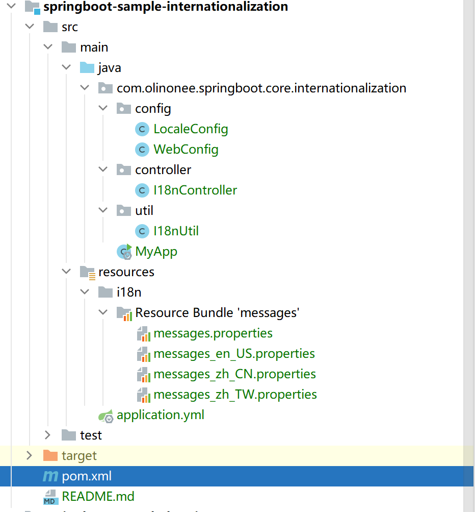
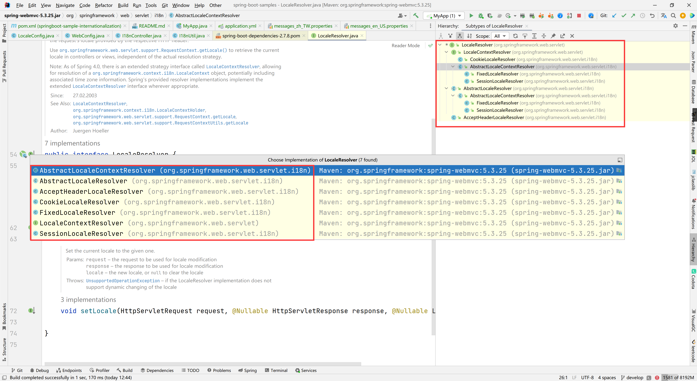
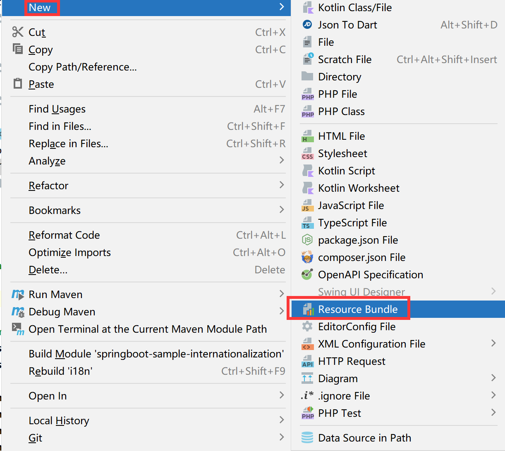
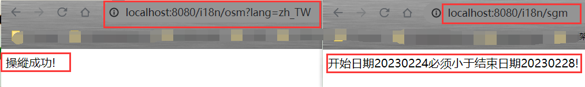

# 国际化（Internationalization）

Spring Boot 支持本地化消息，以便你的应用程序能够迎合不同语言偏好的用户。默认情况下，Spring Boot 会在类路径的根位置查找 `messages` 资源包。

**注意**：

当配置的资源捆绑包的默认属性文件可用时（缺省情况下为 `messages.properties`
），就会应用自动配置。如果你的资源包仅包含特定于语言的属性文件，则需要添加默认的。如果找不到与任何已配置基本名称匹配的属性文件，则不会有自动配置的 `MessageSource`。

可以使用 `spring.messages` 命名空间配置资源包的基本名称以及其他几个属性，如下例所示：

Properties

```properties
spring.messages.basename=messages,config.i18n.messages
spring.messages.fallback-to-system-locale=false
```

Yaml

```yaml
spring:
  messages:
    basename: "messages,config.i18n.messages"
    fallback-to-system-locale: false
```

**TIP**：

`spring.messages.basename` 支持逗号分隔的位置列表，可以是包限定符，也可以是从类路径根解析的资源。

有关更多支持的选项，请参阅 [MessageSourceProperties](https://github.com/spring-projects/spring-boot/tree/v2.7.8/spring-boot-project/spring-boot-autoconfigure/src/main/java/org/springframework/boot/autoconfigure/context/MessageSourceProperties.java)
。

## 实战

### 依赖引入

```xml

<dependency>
    <groupId>org.springframework.boot</groupId>
    <artifactId>spring-boot-starter-web</artifactId>
    <version>2.7.8</version>
</dependency>
```

### 项目结构



### 配置步骤

#### 1.配置解析器

我们首先要来初始化 `LocaleResolver` 接口，该类 SpringBoot 提供了默认实现，如下图所示：



这里我选择 `SessionLocaleResolver` 实现类作为 bean 对象注册到容器中，主要是设置默认的本地化语言为 `Locale.CHINA` （中文），代码如下所示：

```java
import org.springframework.context.annotation.Bean;
import org.springframework.context.annotation.Configuration;
import org.springframework.web.servlet.LocaleResolver;
import org.springframework.web.servlet.i18n.SessionLocaleResolver;

import java.util.Locale;

@Configuration
public class LocaleConfig {

    /**
     * 设置会话的本地化语言默认为中文
     *
     * @return LocaleResolver
     */
    @Bean
    public LocaleResolver localeResolver() {
        final SessionLocaleResolver sessionLocaleResolver = new SessionLocaleResolver();
        sessionLocaleResolver.setDefaultLocale(Locale.CHINA);
        return sessionLocaleResolver;
    }
}
```

#### 2.配置拦截器

配置拦截器的目的主要是用于拦截请求（URL）的请求参数是否携带 “lang” 请求参数，根据请求参数的值来判断读取到具体的国际化语言值。比如：URL
为 `http://localhost:8080/i18n/osm?lang=en_US` ，此时读取的 `lang` 值为 “en_US”，收到请求会自动读取 `messages_en_US.properties`
配置文件中的属性值，示例代码如下：

```java
import org.springframework.context.annotation.Configuration;
import org.springframework.web.servlet.config.annotation.InterceptorRegistry;
import org.springframework.web.servlet.config.annotation.WebMvcConfigurer;
import org.springframework.web.servlet.i18n.LocaleChangeInterceptor;

@Configuration
public class WebConfig implements WebMvcConfigurer {


    /**
     * 默认拦截器，其中 lang 表示切换语言的参数名
     *
     * 比如当请求的 url 为：<a href="https://ip:port/?lang=zh_CN">https://ip:port/?lang=zh_CN</a>，表示读取国际化文件 messages_zh_CN.properties。
     *
     * @param registry 拦截器注册
     */
    @Override
    public void addInterceptors(InterceptorRegistry registry) {
        final LocaleChangeInterceptor localeChangeInterceptor = new LocaleChangeInterceptor();
        localeChangeInterceptor.setParamName("lang");
        registry.addInterceptor(localeChangeInterceptor);
    }
}
```

#### 3.添加国际化文件

首先新增 `i18n` 目录，用于统一管理国际化相关的文件目录；然后新增 `Resource Bundle` 文件，名称定义格式为：“**messages_xxx.properties**”，分别新建
`messages.properties`（必须有，可以为空）、`messages_zh_CN.properties`（可选，中文）、`messages_zh_TW.properties`
（可选，中文繁体）、`messages_en_US.properties`（可选，英文）文件；最后补充好对应的内容信息即可，如下所示：



**messages.properties**：

```properties
operation.success=success!
start.ge.end=The start date {0} must be earlier than the end date {1}!
```

**messages_zh_CN.properties**：

```properties
operation.success=操作成功!
start.ge.end=开始日期{0}必须小于结束日期{1}!
```

**messages_zh_TW.properties**：

```properties
operation.success=操縱成功!
start.ge.end=開始日期 {0} 必須小於結束日期 {1}!
```

**messages_en_US.properties**：

```properties
operation.success=The operation is successful!
start.ge.end=The start date {0} must be earlier than the end date {1}!
```

更多的语言代码与国家地区对照表，可以参考 https://blog.csdn.net/shenenhua/article/details/79150053 链接

在 application.yml 配置文件中新增国际化文件扫描配置规则，如下例所示：

```yaml
spring:
  messages:
    basename: "i18n/messages"
```

**注意**：

前面是没有斜杠的，`i18n` 表示在此目录，为相对路径。而文件名为 `messages`，也不需要添加 `properties` 后缀。

#### 4.添加工具类

添加工具类方便在任何地方都能读取国际化文件内容，这里提供了两种不同的方法来获取，一种是获取固定的信息；一种是获取动态的信息，如下例所示：

同时这里提供了2种方式来读取消息文件，如下所示：

1. 普通方式（主要是借助 `ReloadableResourceBundleMessageSource` 来读取消息文件）

```java
import org.slf4j.Logger;
import org.slf4j.LoggerFactory;
import org.springframework.context.i18n.LocaleContextHolder;
import org.springframework.context.support.ReloadableResourceBundleMessageSource;

import java.nio.charset.StandardCharsets;
import java.util.Locale;

public class I18nUtil {
    private static final Logger logger = LoggerFactory.getLogger(I18nUtil.class);

    /**
     * 获取单个翻译值，固定参数格式
     * <p>
     * 例如：
     * <pre>
     *     operation.success=操作成功!
     *     String msg =getMessage("operation.success");
     * </pre>
     *
     * @param translateMsg 翻译的信息
     * @return 翻译之后的字符串
     */
    public static String get(String translateMsg) {
        ReloadableResourceBundleMessageSource messageSource = new ReloadableResourceBundleMessageSource();
        messageSource.setCacheSeconds(-1);
        messageSource.setDefaultEncoding(StandardCharsets.UTF_8.name());
        // 设置文件基础扫描路径名称
        messageSource.setBasenames("i18n/messages");

        String message = "";
        try {
            Locale locale = LocaleContextHolder.getLocale();
            message = messageSource.getMessage(translateMsg, null, locale);
        } catch (Exception e) {
            logger.error("[I18nUtil#get] - parse message error! ", e);
        }
        return message;
    }

    /**
     * 获取单个翻译值，动态参数格式
     * <p>
     * 例如：
     * <pre>
     *     start.ge.end = 开始日期{0}必须小于结束日期{1}！
     *     String [] param = {startDate, endDate};
     *     String msg =getMessage("start.ge.end", param);
     * </pre>
     *
     * @param translateMsg 翻译的信息，可能携带参数
     * @param params       填充的参数数组
     * @return 翻译之后的字符串
     */
    public static String get(String translateMsg, Object[] params) {
        ReloadableResourceBundleMessageSource messageSource = new ReloadableResourceBundleMessageSource();
        messageSource.setCacheSeconds(-1);
        messageSource.setDefaultEncoding(StandardCharsets.UTF_8.name());
        // 设置文件基础扫描路径名称
        messageSource.setBasenames("i18n/messages");

        String message = "";
        try {
            Locale locale = LocaleContextHolder.getLocale();
            message = messageSource.getMessage(translateMsg, params, locale);
        } catch (Exception e) {
            logger.error("[I18nUtil#get] - parse message error! ", e);
        }
        return message;
    }
}
```

**提示**：

此方式**不需要**在 `application.yml` 中设置 `spring.messages.basename` 属性值，已经在代码中固定了该属性值，具体参考代码。

2. spring 容器工具类（需要注入 `MessageSource` 接口来读取消息文件）

```java
import org.slf4j.Logger;
import org.slf4j.LoggerFactory;
import org.springframework.context.MessageSource;
import org.springframework.context.i18n.LocaleContextHolder;
import org.springframework.stereotype.Component;

import java.util.Locale;

@Component
public class I18nBootUtil {
    private static final Logger logger = LoggerFactory.getLogger(I18nBootUtil.class);

    private static MessageSource messageSource;

    // 注入 MessageSource 属性，方便上下文获取
    private I18nBootUtil(MessageSource messageSource) {
        I18nBootUtil.messageSource = messageSource;
    }

    /**
     * 获取单个翻译值，固定参数格式
     * <p>
     * 例如：
     * <pre>
     *     operation.success=操作成功!
     *     String msg =getMessage("operation.success");
     * </pre>
     *
     * @param translateMsg 翻译的信息
     * @return 翻译之后的字符串
     */
    public static String get(String translateMsg) {

        String message = "";
        try {
            Locale locale = LocaleContextHolder.getLocale();
            message = messageSource.getMessage(translateMsg, null, locale);
        } catch (Exception e) {
            logger.error("[I18nBootUtil#get] - parse message error! ", e);
        }
        return message;
    }

    /**
     * 获取单个翻译值，动态参数格式
     * <p>
     * 例如：
     * <pre>
     *     start.ge.end = 开始日期{0}必须小于结束日期{1}！
     *     String [] param = {startDate, endDate};
     *     String msg =getMessage("start.ge.end", param);
     * </pre>
     *
     * @param translateMsg 翻译的信息，可能携带参数
     * @param params       填充的参数数组
     * @return 翻译之后的字符串
     */
    public static String get(String translateMsg, Object[] params) {
        String message = "";
        try {
            Locale locale = LocaleContextHolder.getLocale();
            message = messageSource.getMessage(translateMsg, params, locale);
        } catch (Exception e) {
            logger.error("[I18nBootUtil#get] - parse message error! ", e);
        }
        return message;
    }
}
```

**提示**：

此方式**必须需要**在 `application.yml` 中设置 `spring.messages.basename` 属性值，不指定值代码会提示解析异常，具体参考代码。

#### 5.添加控制器

```java

@RestController
@RequestMapping("/i18n")
public class I18nController {

    @RequestMapping("/osm")
    public String getOperationSuccessMessage() {
        // return I18nUtil.get("operation.success");
        return I18nBootUtil.get("operation.success");
    }

    @RequestMapping("/sgm")
    public String getStartGeEndMessage() {
        String[] param = {"20230224", "20230228"};
        // return I18nUtil.get("start.ge.end", param);
        return I18nBootUtil.get("start.ge.end", param);
    }
}
```

#### 6.测试

完成上述之后，启动项目，在浏览器输入 http://127.0.0.1:8080/i18n/osm?lang=zh_TW 或者 http://127.0.0.1:8080/i18n/sgm ，出现如下图所示，表示国际化配置成功！




