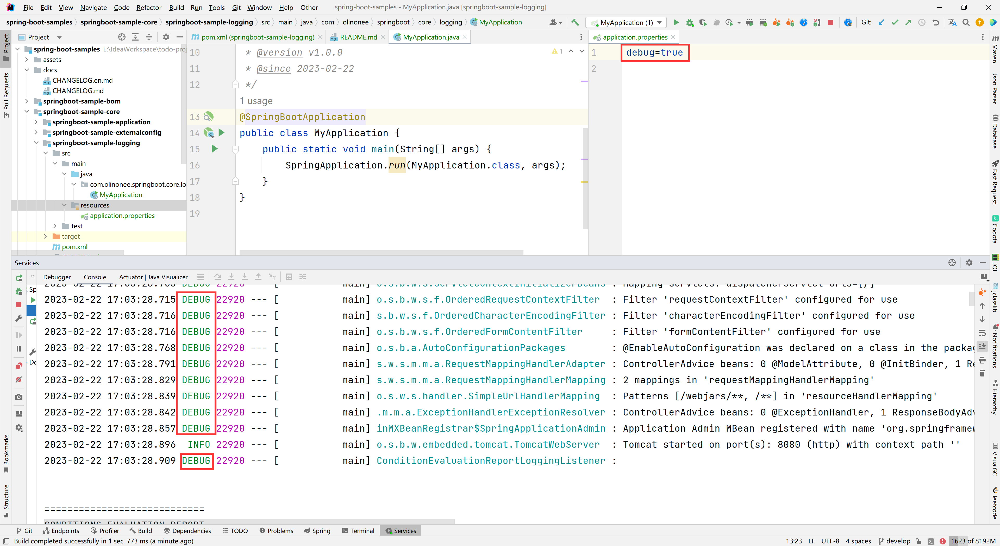
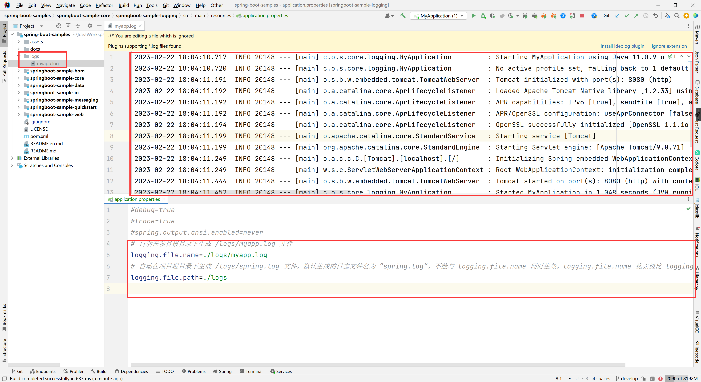

# 日志（Logging）

Spring Boot 使用 [Commons Logging](https://commons.apache.org/logging)
进行所有内部日志记录，但底层日志实现保持打开状态。[Java Util Logging](https://docs.oracle.com/javase/8/docs/api/java/util/logging/package-summary.html)
、[Log4J2](https://logging.apache.org/log4j/2.x/) 和 [Logback](https://logback.qos.ch/)
提供了默认配置。在每种情况下，记录器都预先配置为使用控制台输出，也可以使用可选的文件输出。

默认情况下，如果使用 "Starters"，则使用 Logback 进行日志记录。还包括适当的 Logback 路由，以确保使用 Java Util Logging、Commons Logging、Log4J 或 SLF4J
的依赖库都能正常工作。

**TIP**：

Java 有很多可用的日志框架。如果上面的列表看起来令人困惑，请不要担心。通常，你不需要更改日志依赖关系，Spring Boot 默认值工作正常。

当你将应用程序部署到 Servlet 容器或应用程序服务器时，使用 Java Util Logging API 执行的日志记录不会发送到应用程序的日志中。这将防止容器或已部署到容器的其他应用程序执行的日志记录出现在应用程序的日志中。

## 1.日志格式

Spring Boot 的默认日志输出类似于以下示例：

```text
2023-02-22 16:42:02.015  INFO 11512 --- [           main] c.o.s.core.logging.MyApplication         : Starting MyApplication using Java 11.0.9 on myhost with PID 11512
2023-02-22 16:42:02.017  INFO 11512 --- [           main] c.o.s.core.logging.MyApplication         : No active profile set, falling back to 1 default profile: "default"
2023-02-22 16:42:02.513  INFO 11512 --- [           main] o.s.b.w.embedded.tomcat.TomcatWebServer  : Tomcat initialized with port(s): 8080 (http)
2023-02-22 16:42:02.514  INFO 11512 --- [           main] o.a.catalina.core.AprLifecycleListener   : Loaded Apache Tomcat Native library [1.2.33] using APR version [1.7.0].
2023-02-22 16:42:02.514  INFO 11512 --- [           main] o.a.catalina.core.AprLifecycleListener   : APR capabilities: IPv6 [true], sendfile [true], accept filters [false], random [true], UDS [true].
2023-02-22 16:42:02.514  INFO 11512 --- [           main] o.a.catalina.core.AprLifecycleListener   : APR/OpenSSL configuration: useAprConnector [false], useOpenSSL [true]
2023-02-22 16:42:02.516  INFO 11512 --- [           main] o.a.catalina.core.AprLifecycleListener   : OpenSSL successfully initialized [OpenSSL 1.1.1o  3 May 2022]
2023-02-22 16:42:02.522  INFO 11512 --- [           main] o.apache.catalina.core.StandardService   : Starting service [Tomcat]
2023-02-22 16:42:02.522  INFO 11512 --- [           main] org.apache.catalina.core.StandardEngine  : Starting Servlet engine: [Apache Tomcat/9.0.71]
2023-02-22 16:42:02.573  INFO 11512 --- [           main] o.a.c.c.C.[Tomcat].[localhost].[/]       : Initializing Spring embedded WebApplicationContext
2023-02-22 16:42:02.573  INFO 11512 --- [           main] w.s.c.ServletWebServerApplicationContext : Root WebApplicationContext: initialization completed in 522 ms
2023-02-22 16:42:02.766  INFO 11512 --- [           main] o.s.b.w.embedded.tomcat.TomcatWebServer  : Tomcat started on port(s): 8080 (http) with context path ''
2023-02-22 16:42:02.773  INFO 11512 --- [           main] c.o.s.core.logging.MyApplication         : Started MyApplication in 0.992 seconds (JVM running for 1.786)
```

将输出以下项目：

- 日期和时间：毫秒精度，易于排序；
- 日志级别：`ERROR`、`WARNING`、`INFO`、`DEBUG` 或 `TRACE`；
- 进程ID；
- `---` 分隔符，用于区分实际日志消息的开头；
- 线程名称：用方括号括起来（对于控制台输出，可以截断）；
- 日志记录器名称：这通常是源类名（通常缩写）；
- 日志信息。

**注意**：

Logback 没有 `FATAL` 级别。它被映射到 `ERROR`。

## 2.控制台输出

默认日志配置在写入消息时将消息回显到控制台。默认情况下，记录 `ERROR` -级别、`WARN` -级别和 `INFO` -级别消息。你还可以通过使用 `--debug` 标志启动应用程序来启用“调试”模式。

```shell
$ java -jar myapp.jar --debug
```

**注意**：

你还可以在 `application.properties` 中指定 `debug=true`。如下图所示：



当启用调试模式时，一些核心日志记录器（嵌入式容器、Hibernate 和 Spring Boot）被配置为输出更多信息。启用调试模式不会将应用程序配置为以 `DEBUG` 级别记录所有消息。

或者，你可以通过使用 `--trace` 标志启动应用程序来启用 “跟踪” 模式（或在 `application.properties` 中使用 `trace=true`）。这样可以为选择的核心日志记录器（嵌入式容器、Hibernate
模式生成以及整个 Spring 组合）启用跟踪日志记录。

### 彩色编码输出

如果你的终端支持 ANSI，则使用颜色输出来提高可读性。你可以将 `spring.output.ansi.enabled`
设置为[支持的值](https://docs.spring.io/spring-boot/docs/2.7.8/api/org/springframework/boot/ansi/AnsiOutput.Enabled.html)
，以覆盖自动检测。

通过使用 `%clr` 转换字配置颜色编码。在最简单的形式中，转换器根据日志级别为输出着色，如下例所示：

```shell
%clr(%5p)
```

下表描述了日志级别到颜色的映射：

| 级别    | 颜色  |
|-------|-----|
| FATAL | 红色  |
| ERROR | 红色  |
| WARN  | 黄色  |
| INFO  | 绿色  |
| DEBUG | 绿色  |
| TRACE | 绿色  |

或者，可以通过将其作为转换选项来指定应使用的颜色或样式。例如，要使文本变为黄色，请使用以下设置：

```shell
%clr(%d{yyyy-MM-dd HH:mm:ss.SSS}){yellow}
```

支持以下颜色和样式：

- blue （蓝色的）
- cyan （青色的）
- faint （荧光的）
- green （绿色的）
- magenta （洋红色的）
- red （红色的）
- yellow （黄色的）

## 3.文件输出

默认情况下，Spring Boot 只记录到控制台，不写入日志文件。如果要在控制台输出之外写入日志文件，则需要设置 `logging.file.name` 或 `logging.files.path`
属性（例如，在 `application.properties` ）。

application.properties

```properties
# 自动在项目根目录下生成 /logs/myapp.log 文件
logging.file.name=./logs/myapp.log
# 自动在项目根目录下生成 /logs/spring.log 文件，默认生成的日志文件名为 ”spring.log“，不能与 logging.file.name 同时生效，logging.file.name 优先级比 logging.file.path 高
logging.file.path=./logs
```

下表显示了如何一起使用 `logging.*` 属性：

| `logging.file.name` | `logging.file.path` | 示例         | 描述                                        |
|---------------------|---------------------|------------|-------------------------------------------|
| (none)              | (none)              |            | 仅控制台日志记录                                  |
| 特定文件                | (none)              | `my.log`   | 写入指定的日志文件。名称可以是确切的位置或相对于当前目录。             |
| (none)              | 特定目录                | `/var/log` | 将 `spring.log` 写入指定目录。名称可以是确切的位置或相对于当前目录。 |

日志结果如下图所示：



日志文件在达到 10 MB 时会循环，并且与控制台输出一样，默认情况下会记录错误级别、警告级别和信息级别的消息。

**TIP**：

日志记录属性独立于实际的日志记录基础结构。因此，特定的配置键（比如 Logback 的 `logback.configurationFile` ）不是由 Spring Boot 管理的。

## 4.文件轮换（循环）

如果使用 Logback，则可以使用 `application.properties` 或 `application.yaml` 文件微调日志轮换设置。对于所有其他日志记录系统，你需要自己直接配置轮换设置（例如，如果使用
Log4J2，则可以添加 `log4j2.xml` 或 `log4j2-spring.xml` 文件）。

支持以下循环策略属性：

| 名称                                                     | 描述                      |
|--------------------------------------------------------|-------------------------|
| `logging.logback.rollingpolicy.file-name-pattern`      | 用于创建日志存档的文件名模式          |
| `logging.logback.rollingpolicy.clean-history-on-start` | 是否应在应用程序启动时进行日志归档清理     |
| `logging.logback.rollingpolicy.max-file-size`          | 存档前日志文件的最大大小            |
| `logging.logback.rollingpolicy.total-size-cap`         | 删除之前可以占用的最大日志档案大小       |
| `logging.logback.rollingpolicy.max-history`            | 要保留的归档日志文件的最大数量(默认为 7)。 |

## 5.日志级别

所有支持的日志记录系统都可以通过使用 `logging.level.<logger-name>=<level>` 在 Spring 环境中设置日志记录程序级别（例如，在 `application.properties` 中），其中级别是
TRACE、DEBUG、INFO、WARN、ERROR、FATAL 或 OFF 之一。根日志记录程序可以通过使用 `logging.level.root` 进行配置。

以下示例显示 `application.properties` 中的潜在日志记录设置：

Properties

```properties
logging.level.root=warn
logging.level.org.springframework.web=debug
logging.level.org.hibernate=error
```

Yaml

```yaml
logging:
  level:
    root: "warn"
    org.springframework.web: "debug"
    org.hibernate: "error"
```

还可以使用环境变量设置日志记录级别。例如，`LOGGING_LEVEL_ORG_SPRINGFRAMEWORK_WEB=DEBUG` 将 `org.springframework.web` 设置为 `DEBUG`。

**注意**：

上述方法仅适用于包级日志记录。由于宽松绑定总是将环境变量转换为小写，因此不可能以这种方式为单个类配置日志记录。如果需要为类配置日志记录，可以使用 `SPRING_APPLICATION_JSON` 变量。
