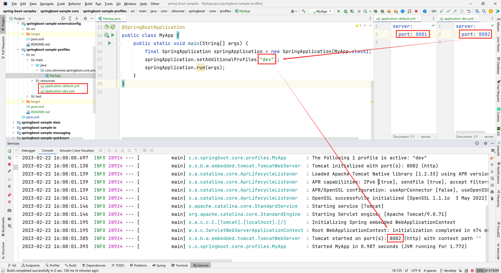

# 配置文件（Profiles）

Spring Profiles 提供了一种方法来隔离应用程序配置的各个部分，并使其仅在某些环境中可用。任何 `@Component`，`@Configuration` 或 `@ConfigurationProperties`
都可以用 `@Profile` 标记来限制加载，如下例所示:

```java
import org.springframework.context.annotation.Configuration;
import org.springframework.context.annotation.Profile;

@Configuration(proxyBeanMethods = false)
@Profile("production")
public class ProductionConfiguration {
    // ...
}
```

**注意**：

如果 `@ConfigurationProperties` bean 是通过 `@EnableConfigurationProperties` 而不是自动扫描注册的，则需要在具有 `@EnableConfigurationProperty`
注释的 `@Configuration` 类上指定 `@Profile` 注解。在扫描 `@ConfigurationProperties` 的情况下，可以在 `@ConfigurationProperties`
类本身上指定 `@Profile`。

可以使用 `spring.profiles.active Environment` 属性来指定哪些配置文件处于活动状态。可以用本章前面描述的任何方式指定属性。例如，可以将其包含在 `application.properties`
中，如下例所示：

Properties

```properties
spring.profiles.active=dev,hsqldb
```

Yaml

```yaml
spring:
  profiles:
    active: "dev,hsqldb"
```

也可以在命令行上使用以下开关指定它：`--spring.profiles.active=dev,hsqldb`。

如果没有激活配置文件，则启用默认配置文件。默认配置文件的名称是 `default` 的，可以使用 `spring.profile.default Environment` 属性对其进行调整，如下例所示：

Properties

```properties
spring.profiles.default=none
```

Yaml

```yaml
spring:
  profiles:
    default: "none"
```

`spring.profiles.active` 和 `spring.profiles.default` 只能在非配置文件特定的文档中使用。这意味着它们不能包含在 `spring.config.activate.on-profile`
激活的特定于配置文件的文件或文档中。

例如，第二个文档配置无效：

Properties

```properties
# this document is valid
spring.profiles.active=prod
#---
# this document is invalid
spring.config.activate.on-profile=prod
spring.profiles.active=metrics
```

Yaml

```yaml
# this document is valid
spring:
  profiles:
    active: "prod"
---
# this document is invalid
spring:
  config:
    activate:
      on-profile: "prod"
  profiles:
    active: "metrics"
```

## 1.添加 active 配置文件

`spring.profiles.active` 属性遵循与其他属性相同的排序规则：`PropertySource` 优先级最高者获胜。这意味着你可以在 `application.properties`
中指定活动配置文件，然后使用命令行开关**替换**它们。

有时，将属性添加到活动配置文件而不是替换它们是很有用的。`spring.profiles.include` 属性可用于在 `spring.profiles.active`
属性激活的配置文件之上添加活动配置文件。`SpringApplication` 入口点还具有用于设置其他概要文件的 Java
API。请参阅 [SpringApplication](https://docs.spring.io/spring-boot/docs/2.7.8/api/org/springframework/boot/SpringApplication.html)
中的 `setAdditionalProfiles()` 方法。

例如，当运行具有以下属性的应用程序时，即使使用 `--spring.profiles.active` 开关运行，也会激活通用和本地配置文件：

Properties

```properties
spring.profiles.include[0]=common
spring.profiles.include[1]=local
```

Yaml

```yaml
spring:
  profiles:
    include:
      - "common"
      - "local"
```

**警告**：

与 `spring.profile.active` 类似，`spring.profile.include` 只能用于非配置文件特定的文档。这意味着它不能包含在 `spring.config.activate.on-profile`
激活的特定于配置文件的文件或文档中。

如果给定的配置文件处于活动状态，则下一节中介绍的配置文件组也可用于添加活动配置文件。

## 2.配置文件组

有时，你在应用程序中定义和使用的配置文件过于细粒度，使用起来很麻烦。例如，你可以使用 `proddb` 和 `prodmq` 配置文件来独立启用数据库和消息传递功能。

为了帮助实现这一点，Spring Boot 允许你定义配置文件组。配置文件组允许你为相关的配置文件组定义逻辑名称。

例如，我们可以创建一个由 `proddb` 和 `prodmq` 配置文件组成的生产组。

Properties

```properties
spring.profiles.group.production[0]=proddb
spring.profiles.group.production[1]=prodmq
```

Yaml

```yaml
spring:
  profiles:
    group:
      production:
        - "proddb"
        - "prodmq"
```

我们的应用程序现在可以使用 `--spring.profiles.active=production` 启动 `production`、`proddb` 和 `prodmq` 配置文件。

## 3.编程设置配置文件

你可以通过在应用程序运行之前调用 `SpringApplication.setAdditionalProfiles(…)` 以编程方式设置活动配置文件。还可以使用 Spring 的 `ConfigurationEnvironment`
接口激活配置文件。如下图所示：



## 4.特定于配置文件的配置文件

`application.properties`（或 `application.yml` ）和通过 `@ConfigurationProperties` 引用的文件的特定于配置文件的变量都被视为文件并被加载。
