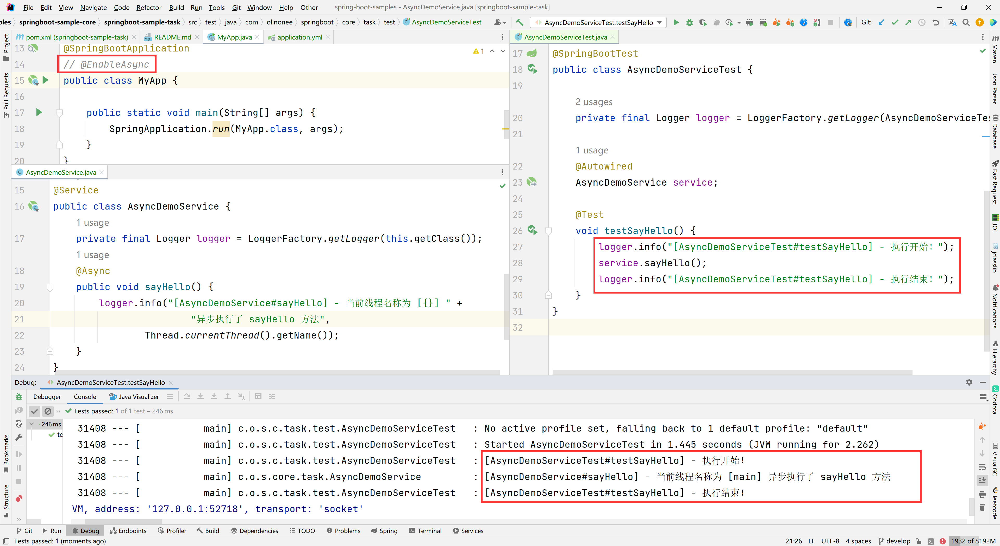

# 任务执行与调度（Task Execution and Scheduling）

在上下文中没有 `Executor` bean 的情况下，Spring Boot 会自动配置 `ThreadPoolTaskExecutor`，并使用可自动关联到异步任务执行（`@EnableAsync`）和 Spring MVC
异步请求处理的合理默认值。

**TIP**：

如果在上下文中定义了自定义 `Executor`，则常规任务执行（即 `@EnableAsync`）将透明地使用它，但不会配置 Spring MVC 支持，因为它需要 `AsyncTaskExecutor`
实现（名为 `applicationTaskExecutor`）。根据你的目标安排，你可以将 `Executor` 更改为 `ThreadPoolTaskExecutor`，或者同时定义 `ThreadPoolTaskExecutor`
和 `AsyncConfigurer` 来包装自定义 `Executor`。

自动配置的 `TaskExecutorBuilder` 允许你轻松创建复制默认情况下自动配置的实例。

## 任务执行器

线程池使用 8 个核心线程，可以根据负载增长和收缩。可以使用 `spring.task.execution` 命名空间对这些默认设置进行微调，如下例所示：

Properties

```properties
spring.task.execution.pool.max-size=16
spring.task.execution.pool.queue-capacity=100
spring.task.execution.pool.keep-alive=10s
```

Yaml

```yaml
spring:
  task:
    execution:
      pool:
        max-size: 16
        queue-capacity: 100
        keep-alive: "10s"
```

这将更改线程池以使用有界队列，这样当队列已满（100个任务）时，线程池将增加到最多 16 个线程。当线程空闲 10 秒（而不是默认情况下的60秒）时，会回收线程，因此池的收缩更为积极。

## 任务调度器

如果需要关联到计划的任务执行（例如使用 `@EnableScheduling`），也可以自动配置 `ThreadPoolTaskScheduler`
。默认情况下，线程池使用一个线程，其设置可以使用 `spring.task.scheduling` 命名空间进行微调，如下例所示：

Properties

```properties
spring.task.scheduling.thread-name-prefix=scheduling-
spring.task.scheduling.pool.size=2
```

Yaml

```yaml
spring:
  task:
    scheduling:
      thread-name-prefix: "scheduling-"
      pool:
        size: 2
```

如果需要创建自定义执行器或调度器，则 `TaskExecutorBuilder` Bean 和 `TaskSchedulerBuilder` Bean都可以在上下文中使用。

## 任务执行实战

### 使用 SpringBoot 默认的线程池机制

#### 同步任务执行

在异步任务执行中，启动类或者配置类上面没有启用 `@EnableAsync` 注解，异步任务会自动变成同步任务，如下图所示：



#### 异步任务执行

启动类或者配置类上面启用 `@EnableAsync` 注解，异步任务开启，如下图所示：


#### 扩展

##### 线程默认配置信息


```properties
# 是否允许核心线程超时，默认为 true
spring.task.execution.pool.allow-core-thread-timeout=true
# 核心线程数，默认为 8
spring.task.execution.pool.core-size=8
# 线程在终止前可以保持空闲的时间限制，默认为 60s
spring.task.execution.pool.keep-alive=60s
# 允许的最大线程数，默认为 0x7fffffff（2^31-1）
spring.task.execution.pool.max-size=Integer.MAX_VALUE
# 线程队列容量，默认为 0x7fffffff（2^31-1）
spring.task.execution.pool.queue-capacity=Integer.MAX_VALUE
# 执行器是否应该等待计划任务在关闭时完成，默认为 false
spring.task.execution.shutdown.await-termination=false
# 执行器应等待剩余任务完成的最长时间
spring.task.execution.shutdown.await-termination-period=Duration
# 新创建的线程使用的前缀，默认为 task-
spring.task.execution.thread-name-prefix=task-
```

关于 SpringBoot 默认线程配置参数可以参考 `org.springframework.boot.autoconfigure.task.TaskExecutionProperties` 类

##### 自动配置类

根据官方文档的说明，自动配置的 `TaskExecutorBuilder` 允许轻松复制默认情况下自动配置的实例。最终找到 SpringBoot 的线程池自动装配类 `TaskExecutionAutoConfiguration`
也是用 `TaskExecutorBuilder`，源码如下所示：

```java

@ConditionalOnClass(ThreadPoolTaskExecutor.class)
@AutoConfiguration
@EnableConfigurationProperties(TaskExecutionProperties.class)
public class TaskExecutionAutoConfiguration {

    /**
     * Bean name of the application {@link TaskExecutor}.
     */
    public static final String APPLICATION_TASK_EXECUTOR_BEAN_NAME = "applicationTaskExecutor";

    @Bean
    @ConditionalOnMissingBean
    public TaskExecutorBuilder taskExecutorBuilder(TaskExecutionProperties properties,
                                                   ObjectProvider<TaskExecutorCustomizer> taskExecutorCustomizers,
                                                   ObjectProvider<TaskDecorator> taskDecorator) {
        TaskExecutionProperties.Pool pool = properties.getPool();
        TaskExecutorBuilder builder = new TaskExecutorBuilder();
        builder = builder.queueCapacity(pool.getQueueCapacity());
        builder = builder.corePoolSize(pool.getCoreSize());
        builder = builder.maxPoolSize(pool.getMaxSize());
        builder = builder.allowCoreThreadTimeOut(pool.isAllowCoreThreadTimeout());
        builder = builder.keepAlive(pool.getKeepAlive());
        Shutdown shutdown = properties.getShutdown();
        builder = builder.awaitTermination(shutdown.isAwaitTermination());
        builder = builder.awaitTerminationPeriod(shutdown.getAwaitTerminationPeriod());
        builder = builder.threadNamePrefix(properties.getThreadNamePrefix());
        builder = builder.customizers(taskExecutorCustomizers.orderedStream()::iterator);
        builder = builder.taskDecorator(taskDecorator.getIfUnique());
        return builder;
    }

    @Lazy
    @Bean(name = {APPLICATION_TASK_EXECUTOR_BEAN_NAME,
            AsyncAnnotationBeanPostProcessor.DEFAULT_TASK_EXECUTOR_BEAN_NAME})
    @ConditionalOnMissingBean(Executor.class)
    public ThreadPoolTaskExecutor applicationTaskExecutor(TaskExecutorBuilder builder) {
        return builder.build();
    }

}
```

从源码中不难看出自动配置类作用于的条件类是 `ThreadPoolTaskExecutor` ，深入此类，可以看出初始化执行器为 `ThreadPoolExecutor`，源码如下所示：

```java
public class ThreadPoolTaskExecutor extends ExecutorConfigurationSupport
        implements AsyncListenableTaskExecutor, SchedulingTaskExecutor {

    // ...

    @Override
    protected ExecutorService initializeExecutor(
            ThreadFactory threadFactory, RejectedExecutionHandler rejectedExecutionHandler) {

        BlockingQueue<Runnable> queue = createQueue(this.queueCapacity);

        ThreadPoolExecutor executor;
        if (this.taskDecorator != null) {
            executor = new ThreadPoolExecutor(
                    this.corePoolSize, this.maxPoolSize, this.keepAliveSeconds, TimeUnit.SECONDS,
                    queue, threadFactory, rejectedExecutionHandler) {
                @Override
                public void execute(Runnable command) {
                    Runnable decorated = taskDecorator.decorate(command);
                    if (decorated != command) {
                        decoratedTaskMap.put(decorated, command);
                    }
                    super.execute(decorated);
                }
            };
        } else {
            executor = new ThreadPoolExecutor(
                    this.corePoolSize, this.maxPoolSize, this.keepAliveSeconds, TimeUnit.SECONDS,
                    queue, threadFactory, rejectedExecutionHandler);
        }

        if (this.allowCoreThreadTimeOut) {
            executor.allowCoreThreadTimeOut(true);
        }
        if (this.prestartAllCoreThreads) {
            executor.prestartAllCoreThreads();
        }

        this.threadPoolExecutor = executor;
        return executor;
    }

    // ...
}
```

同样地，根据初始化执行器方法不难看出来自于抽象父类 `ExecutorConfigurationSupport` 的抽象方法，父类也对该方法进行了初始化处理，这里包括线程执行的拒绝策略是 `AbortPolicy`。源码如下所示：

```java
public abstract class ExecutorConfigurationSupport extends CustomizableThreadFactory
        implements BeanNameAware, InitializingBean, DisposableBean {
    // ...

    private RejectedExecutionHandler rejectedExecutionHandler = new ThreadPoolExecutor.AbortPolicy();

    // ...

    public void initialize() {
        if (logger.isDebugEnabled()) {
            logger.debug("Initializing ExecutorService" + (this.beanName != null ? " '" + this.beanName + "'" : ""));
        }
        if (!this.threadNamePrefixSet && this.beanName != null) {
            setThreadNamePrefix(this.beanName + "-");
        }
        this.executor = initializeExecutor(this.threadFactory, this.rejectedExecutionHandler);
    }

    // ...

    protected abstract ExecutorService initializeExecutor(
            ThreadFactory threadFactory, RejectedExecutionHandler rejectedExecutionHandler);
}
```

##### 线程池拒绝策略

官方 api 注释说明，如下图所示：


| 拒绝策略                | 描述                                                      |
|---------------------|---------------------------------------------------------|
| AbortPolicy         | 处理程序在被拒绝时抛出运行时 `RejectedExecutionExecutionException` 异常 |
| CallerRunsPolicy    | 调用 execute 本身的线程运行任务。这提供了一种简单的反馈控制机制，可以减慢提交新任务的速度       |
| DiscardPolicy       | 简单地删除无法执行的任务                                            |
| DiscardOldestPolicy | 如果没有关闭执行器，则会丢弃工作队列顶部的任务，然后重试执行(这可能会再次失败，导致重复执行)         |

### 使用自定义的线程池

#### 自定义配置类

通过实现 `AsyncConfigurer` 接口来实现自定义线程池的配置，示例代码如下所示：

```java

@Configuration
@EnableAsync
public class TaskExecutorDemoConfig implements AsyncConfigurer {

    private static final Logger logger = LoggerFactory.getLogger(TaskExecutorDemoConfig.class);

    /**
     * 通过重写 getAsyncExecutor 方法，制定默认的任务执行由该方法产生
     *
     * @return Executor
     */
    @Override
    public Executor getAsyncExecutor() {
        final ThreadPoolTaskExecutor threadPoolTaskExecutor = new ThreadPoolTaskExecutor();
        threadPoolTaskExecutor.setCorePoolSize(5);
        threadPoolTaskExecutor.setMaxPoolSize(64);
        threadPoolTaskExecutor.setQueueCapacity(64);
        threadPoolTaskExecutor.setKeepAliveSeconds(30);
        threadPoolTaskExecutor.setAllowCoreThreadTimeOut(true);
        threadPoolTaskExecutor.setThreadNamePrefix("defaultTask-");
        threadPoolTaskExecutor.setRejectedExecutionHandler(new ThreadPoolExecutor.AbortPolicy());
        threadPoolTaskExecutor.initialize();
        return threadPoolTaskExecutor;
    }

    /**
     * 异步任务执行异常处理器
     *
     * @return AsyncUncaughtExceptionHandler 实现
     */
    @Override
    public AsyncUncaughtExceptionHandler getAsyncUncaughtExceptionHandler() {
        return (ex, method, params) -> {
            logger.warn("[TaskExecutorDemoConfig#getAsyncUncaughtExceptionHandler] - 异步任务执行异常");
            logger.error("方法名为 [{}]，参数为 {}，执行异步任务发生异常，异常信息为：{} ", method.getName(), params, ex.getMessage());
        };
    }

    /**
     * 自定义任务执行器：在定义了多个任务执行器的情况下，可以使用 @Async("getCustomizerAsyncExecutor") 来指定
     *
     * @return Executor
     */
    @Bean("getCustomizerAsyncExecutor")
    public Executor getCustomizerAsyncExecutor() {
        final ThreadPoolTaskExecutor threadPoolTaskExecutor = new ThreadPoolTaskExecutor();
        threadPoolTaskExecutor.setCorePoolSize(1);
        threadPoolTaskExecutor.setMaxPoolSize(16);
        threadPoolTaskExecutor.setQueueCapacity(32);
        threadPoolTaskExecutor.setKeepAliveSeconds(10);
        threadPoolTaskExecutor.setAllowCoreThreadTimeOut(true);
        threadPoolTaskExecutor.setThreadNamePrefix("customTask-");
        threadPoolTaskExecutor.setRejectedExecutionHandler(new ThreadPoolExecutor.CallerRunsPolicy());
        threadPoolTaskExecutor.initialize();
        return threadPoolTaskExecutor;
    }
}
```

#### 新增业务类

模拟实际开发中的异步执行某些任务的业务场景，示例代码如下：

```java

@Service
public class AsyncDemoService {

    private final Logger logger = LoggerFactory.getLogger(this.getClass());

    @Async
    public void sayHello() {
        logger.info("[AsyncDemoService#sayHello] - 当前线程名称为 [{}] " +
                        "异步执行了 sayHello 方法",
                Thread.currentThread().getName());
    }

    @Async(value = "getCustomizerAsyncExecutor")
    public void sayHi() {
        logger.info("[AsyncDemoService#sayHi] - 当前线程名称为 [{}] " +
                        "异步执行了 sayHi 方法",
                Thread.currentThread().getName());
        throw new RuntimeException("手动抛出一个异常");
    }
}
```

#### 新增测试类

模拟调用异步执行的方法，示例代码如下：

```java

@SpringBootTest
public class AsyncDemoServiceTest {

    private final Logger logger = LoggerFactory.getLogger(AsyncDemoServiceTest.class);

    @Autowired
    AsyncDemoService service;

    @Test
    void testSayHello() {
        logger.info("[AsyncDemoServiceTest#testSayHello] - 执行开始！");
        service.sayHello();
        logger.info("[AsyncDemoServiceTest#testSayHello] - 执行结束！");
    }

    @Test
    void testSayHi() {
        logger.info("[AsyncDemoServiceTest#testSayHi] - 执行开始！");
        service.sayHi();
        logger.info("[AsyncDemoServiceTest#testSayHi] - 执行结束！");
    }
}
```

#### 运行测试类

测试结果如下所示：

```text
// ...

2023-02-25 15:41:13.429  INFO 2088 --- [           main] c.o.s.c.task.test.AsyncDemoServiceTest   : [AsyncDemoServiceTest#testSayHello] - 执行开始！
2023-02-25 15:41:13.435  INFO 2088 --- [           main] c.o.s.c.task.test.AsyncDemoServiceTest   : [AsyncDemoServiceTest#testSayHello] - 执行结束！
2023-02-25 15:41:13.443  INFO 2088 --- [  defaultTask-1] c.o.s.core.task.AsyncDemoService         : [AsyncDemoService#sayHello] - 当前线程名称为 [defaultTask-1] 异步执行了 sayHello 方法
2023-02-25 15:41:13.452  INFO 2088 --- [           main] c.o.s.c.task.test.AsyncDemoServiceTest   : [AsyncDemoServiceTest#testSayHi] - 执行开始！
2023-02-25 15:41:13.454  INFO 2088 --- [           main] c.o.s.c.task.test.AsyncDemoServiceTest   : [AsyncDemoServiceTest#testSayHi] - 执行结束！
2023-02-25 15:41:13.454  INFO 2088 --- [   customTask-1] c.o.s.core.task.AsyncDemoService         : [AsyncDemoService#sayHi] - 当前线程名称为 [customTask-1] 异步执行了 sayHi 方法
2023-02-25 15:41:13.455  WARN 2088 --- [   customTask-1] c.o.s.c.t.config.TaskExecutorDemoConfig  : [TaskExecutorDemoConfig#getAsyncUncaughtExceptionHandler] - 异步任务执行异常
2023-02-25 15:41:13.455 ERROR 2088 --- [   customTask-1] c.o.s.c.t.config.TaskExecutorDemoConfig  : 方法名为 [sayHi]，参数为 []，执行异步任务发生异常，异常信息为：手动抛出一个异常
```

综上所述，不难看出 `@Async` 注解不指定值（`@Async(value ="")`），执行配置类中默认的 Executor 线程池配置 bean 实现；反之，执行配置类中指定值的 Executor 线程池配置 bean 实现。

### 直接调用 ThreadPoolTaskExecutor 异步执行

通过直接调用 `ThreadPoolTaskExecutor` 来异步执行业务，示例代码如下：

```java

@SpringBootTest
public class AsyncDemoServiceTest {

    private final Logger logger = LoggerFactory.getLogger(AsyncDemoServiceTest.class);

    @Autowired
    AsyncDemoService service;

    @Autowired
    ThreadPoolTaskExecutor threadPoolTaskExecutor;

    @Test
    void testThreadPoolTaskExecutor() {
        logger.info("[AsyncDemoServiceTest#testThreadPoolTaskExecutor] - 执行开始！");
        // 调用异步 sayHi 方法
        service.sayHi();
        // 直接执行异步
        threadPoolTaskExecutor.submit(() -> {
            logger.info("[AsyncDemoServiceTest#testThreadPoolTaskExecutor] - 当前线程名称为 [{}] 异步执行",
                    Thread.currentThread().getName());
        });
        // 调用异步 sayHello 方法
        service.sayHello();
        logger.info("[AsyncDemoServiceTest#testThreadPoolTaskExecutor] - 执行结束！");
    }
}
```

**TIP**：

使用直接调用的方式不需要 `@EnableAsync` 注解，不推荐直接在代码中使用此方式，不便于管理。

## 任务调度实战

### 使用 SpringBoot 定时任务

#### 基于注解

这里是用 `@Scheduled` + `@EnableScheduling` 注解联合使用，示例代码如下所示：

- **@EnableScheduling**：在配置类上使用，开启计划任务的支持
- **@Scheduled**：来声明这是一个任务，包括 cron，fixDelay，fixRate 等类型（方法上，需先开启计划任务的支持）

```java

@Service
@EnableScheduling
public class ScheduleTaskDemoService {

    private final Logger logger = LoggerFactory.getLogger(this.getClass());

    /**
     * 从第 0 秒开始，每 5 秒输出一次信息
     */
    @Scheduled(cron = "0/5 * * * * ? ")
    public void execOnce5Second() {
        logger.info("[ScheduleTaskDemoService#execOnce5Second] - 每 5 秒输出一次，当前时间为 {}", new SimpleDateFormat("yyyy-MM-dd HH:mm:ss").format(new Date()));
    }

    /**
     * 从第 5 秒开始，每 10 秒输出一次信息
     */
    @Scheduled(cron = "5/10 * * * * ? ")
    public void execOnce10Second() {
        logger.info("[ScheduleTaskDemoService#execOnce10Second] - 每 10 秒输出一次，当前时间为 {}", new SimpleDateFormat("yyyy-MM-dd HH:mm:ss").format(new Date()));
    }
}
```

执行结果如下所示：

```text
...
2023-02-25 17:31:14.605  INFO 32084 --- [           main] o.s.b.w.embedded.tomcat.TomcatWebServer  : Tomcat started on port(s): 8080 (http) with context path ''
2023-02-25 17:31:14.615  INFO 32084 --- [           main] com.olinonee.springboot.core.task.MyApp  : Started MyApp in 1.125 seconds (JVM running for 1.813)
2023-02-25 17:31:15.009  INFO 32084 --- [   scheduling-1] c.o.s.core.task.ScheduleTaskDemoService  : [ScheduleTaskDemoService#execOnce5Second] - 每 5 秒输出一次，当前时间为 2023-02-25 17:31:15
2023-02-25 17:31:15.011  INFO 32084 --- [   scheduling-1] c.o.s.core.task.ScheduleTaskDemoService  : [ScheduleTaskDemoService#execOnce10Second] - 每 10 秒输出一次，当前时间为 2023-02-25 17:31:15
2023-02-25 17:31:20.009  INFO 32084 --- [   scheduling-1] c.o.s.core.task.ScheduleTaskDemoService  : [ScheduleTaskDemoService#execOnce5Second] - 每 5 秒输出一次，当前时间为 2023-02-25 17:31:20
2023-02-25 17:31:25.012  INFO 32084 --- [   scheduling-1] c.o.s.core.task.ScheduleTaskDemoService  : [ScheduleTaskDemoService#execOnce5Second] - 每 5 秒输出一次，当前时间为 2023-02-25 17:31:25
2023-02-25 17:31:25.012  INFO 32084 --- [   scheduling-1] c.o.s.core.task.ScheduleTaskDemoService  : [ScheduleTaskDemoService#execOnce10Second] - 每 10 秒输出一次，当前时间为 2023-02-25 17:31:25
2023-02-25 17:31:30.009  INFO 32084 --- [   scheduling-1] c.o.s.core.task.ScheduleTaskDemoService  : [ScheduleTaskDemoService#execOnce5Second] - 每 5 秒输出一次，当前时间为 2023-02-25 17:31:30
2023-02-25 17:31:35.010  INFO 32084 --- [   scheduling-1] c.o.s.core.task.ScheduleTaskDemoService  : [ScheduleTaskDemoService#execOnce5Second] - 每 5 秒输出一次，当前时间为 2023-02-25 17:31:35
...
```

从执行结果上不难看出，默认的定时任务是单线程（例如示例中的 `scheduling-1` 线程名称）的，想要多线程输出，请修改 `application.properties` 的默认参数配置属性，如下所示：

```properties
# 允许使用 2 个线程来执行定时任务
spring.task.scheduling.pool.size=2
```

##### 参数默认配置信息


```properties
# 允许的最大线程数，默认为 1（也就是单线程）
spring.task.scheduling.pool.size=1
# 执行器是否应该等待计划任务在关闭时完成，默认为 false
spring.task.scheduling.shutdown.await-termination=false
# 执行器应等待剩余任务完成的最长时间
spring.task.scheduling.shutdown.await-termination-period=Duration
# 创建新的线程使用的名称前缀，默认为 ”scheduling-“
spring.task.scheduling.thread-name-prefix=scheduling-
```

##### @Scheduled 注解各参数信息
注解源码如下所示：

```java
@Target({ElementType.METHOD, ElementType.ANNOTATION_TYPE})
@Retention(RetentionPolicy.RUNTIME)
@Documented
@Repeatable(Schedules.class)
public @interface Scheduled {
    
	String CRON_DISABLED = "-";
    
	String cron() default "";

	String zone() default "";

	long fixedDelay() default -1;

	String fixedDelayString() default "";

	long fixedRate() default -1;

	String fixedRateString() default "";

	long initialDelay() default -1;

	String initialDelayString() default "";

	TimeUnit timeUnit() default TimeUnit.MILLISECONDS;
}
```


| 属性                 | 描述                                                          | 示例                                            |
|--------------------|-------------------------------------------------------------|-----------------------------------------------|
| cron               | 一个类似 cron 的表达式，扩展了通常的UN*X定义，以包括秒、分、小时、月中的第一天、月和星期中的第一天的触发器。 | `0/5 * * * * ? ` 表示每5秒执行1次任务，从0秒开始，注意"?"后面有空格 |
| zone               | 将解析cron表达式的时区。默认情况下，此属性为空String(即将使用服务器的本地时区)。              | Asia/Shanghai，中国默认时区                          |
| fixedDelay         |                                                             |                                               |
| fixedDelayString   |                                                             |                                               |
| fixedRate          |                                                             |                                               |
| fixedRateString    |                                                             |                                               |
| initialDelay       |                                                             |                                               |
| initialDelayString |                                                             |                                               |
| timeUnit           |                                                             |                                               |
