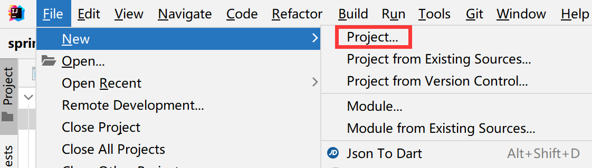
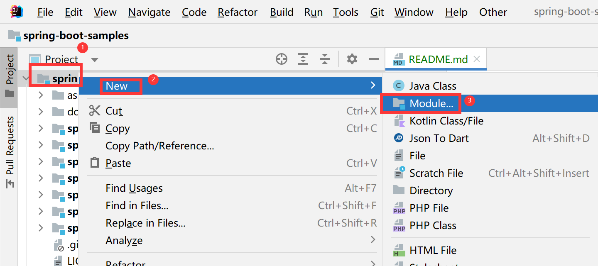
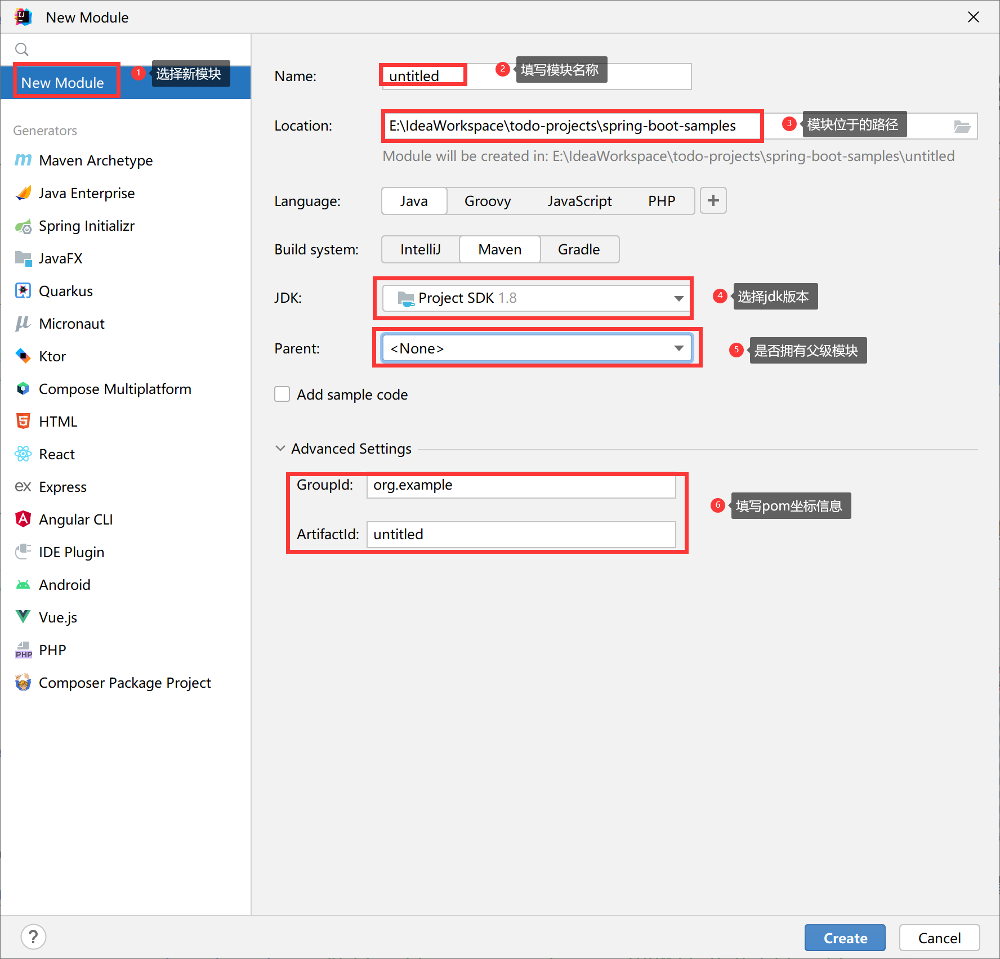
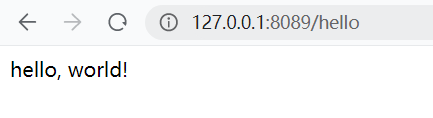
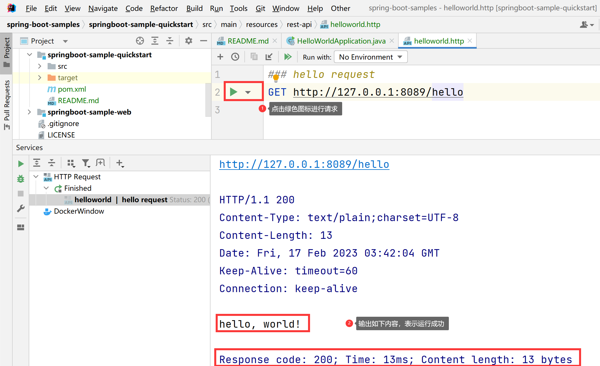

# SpringBoot HelloWorld

**功能：**
> 浏览器发送 hello 请求，服务器接收请求并处理，响应 “hello, world!” JSON 格式的数据字符串。

## 1.创建 maven 工程

开发工具：idea (V2022.1.1)

步骤：

- 首先创建项目

**步骤**：File -> New -> Project...



- 其次创建模块

**步骤**：右击已创建的项目 -> New -> Module...



- 最后选择 New Module 类别项目

**步骤**：弹出框中选择 New Module -> 填写模块名称 -> 选择模块路径(默认是当前项目目录) -> 选择 JDK 版本(如果有多个版本的话) -> 是否有父级模块(首次创建模块为 None) -> 填写坐标信息



## 2.导入 web 依赖

```xml
<?xml version="1.0" encoding="UTF-8"?>
<project xmlns="http://maven.apache.org/POM/4.0.0"
         xmlns:xsi="http://www.w3.org/2001/XMLSchema-instance"
         xsi:schemaLocation="http://maven.apache.org/POM/4.0.0 http://maven.apache.org/xsd/maven-4.0.0.xsd">
    <!-- spring boot 父级依赖 -->
    <parent>
        <groupId>org.springframework.boot</groupId>
        <artifactId>spring‐boot‐starter‐parent</artifactId>
        <version>2.7.8</version>
    </parent>

    <dependencies>
        <dependency>
            <!-- 启动一个 SpringBoot 项目，需要引入此依赖 -->
            <groupId>org.springframework.boot</groupId>
            <artifactId>spring-boot-starter-web</artifactId>
        </dependency>
    </dependencies>
</project>
```

**Tips**：
> 本项目中由于进行版本统一管理，为了后面不重复引入 **spring boot** 相关依赖，特此在 `springboot-sample-bom` 模块中锁定了 **spring boot** 的版本。

**本项目采用的方式：**

```xml
<?xml version="1.0" encoding="UTF-8"?>
<project xmlns="http://maven.apache.org/POM/4.0.0"
         xmlns:xsi="http://www.w3.org/2001/XMLSchema-instance"
         xsi:schemaLocation="http://maven.apache.org/POM/4.0.0 http://maven.apache.org/xsd/maven-4.0.0.xsd">
    <modelVersion>4.0.0</modelVersion>

    <properties>
        <spring.boot.version>2.7.8</spring.boot.version>
    </properties>

    <dependencyManagement>
        <dependencies>
            <dependency>
                <groupId>org.springframework.boot</groupId>
                <artifactId>spring-boot-dependencies</artifactId>
                <version>${spring.boot.version}</version>
                <type>pom</type>
                <scope>import</scope>
            </dependency>
        </dependencies>
    </dependencyManagement>

</project>
```

## 3.编写主程序并启动运行

```java

@RestController
@SpringBootApplication
public class HelloWorldApplication {

    public static void main(String[] args) {
        SpringApplication.run(HelloWorldApplication.class, args);
    }

    @RequestMapping("/hello")
    public String hello() {
        return "hello, world!";
    }
}
```

**说明**：

- **@RestController**：`@Controller + @ResponseBody` 组合注解，标识这个类是控制器，可以提供对外访问的 **restful** 风格请求接口
- **@SpringBootApplication**：标识这个类是一个 **SpringBoot** 的应用程序，同时是一个主程序类
- **@RequestMapping**：标识这个方法(或者类)请求映射路径，例如：_http://ip:port/hello_，这类的 `/hello` 就表示注释方法的映射

## 4.主程序测试

- 方式一：浏览器输入 http://ip:port/hello 地址，出现如下图所示表示程序运行成功！



- 方式二：idea 工具中编写 helloworld.http ，内容如下：

```http request
### hello request
GET http://127.0.0.1:8089/hello
```

出现如下图所示表示程序运行成功！


